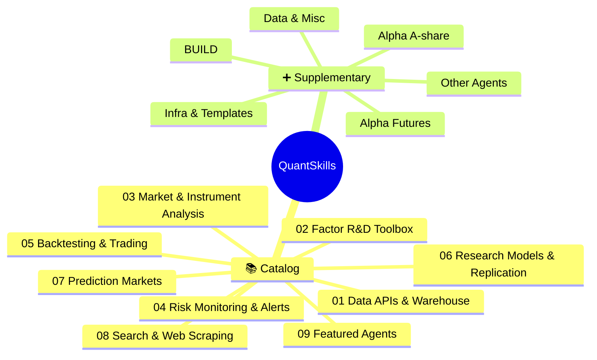

<!-- 本文件由 scripts/build.mjs 自动生成，请勿手工编辑。Generated file — do not edit by hand. -->
# 🧭 quantskills
> A panoramic, clickable navigator for the QuantSkills org — skills / factors / agents at a glance.

[简体中文](README.md) | **English**

   

**QUANTSKILLS** is an open community for **Quant Skills and Agents** in the AI Agent era. Initiated by [PandaAI](https://www.tqx.ai/), it helps quant developers turn trading experience, research methods, factor models, and strategy code into standardized assets that can be **searched, installed, validated, and shared**.

> Turn your quant experience into Skills that humans can trust and AI Agents can use.

## 🗺️ Overview

## 📑 Contents
- [01 Data APIs & Warehouse](#cat-01)
- [02 Factor R&D Toolbox](#cat-02)
- [03 Market & Instrument Analysis](#cat-03)
- [04 Risk Monitoring & Alerts](#cat-04)
- [05 Backtesting & Trading](#cat-05)
- [06 Research Models & Replication](#cat-06)
- [07 Prediction Markets](#cat-07)
- [08 Search & Web Scraping](#cat-08)
- [09 Featured Agents](#cat-09)
- [📊 Alpha Factors · A-share](#alpha-ashare)
- [📊 Alpha Factors · Futures](#alpha-futures)
- [🏗️ BUILD Skills](#build)
- [🤖 Other Agents](#agents)
- [🗄️ Data & Misc](#others)
- [🧱 Infra & Templates](#infra)

## 01 Data APIs & Warehouse

| Project | Description | Screenshot |
|---|---|---|
| [skill-pandadata-warehouse](https://github.com/quantskills/skill-pandadata-warehouse) | Pandadata warehouse skill for caching, refreshing, querying, and validating local DuckDB and Parquet market-data stores. |  |
| [skill-pandadata-api](https://github.com/quantskills/skill-pandadata-api) | Pandadata and panda_data Python SDK reference skill for selecting, calling, and troubleshooting quant data APIs. | — |

## 02 Factor R&D Toolbox

| Project | Description | Screenshot |
|---|---|---|
| [skill-factor-blend](https://github.com/quantskills/skill-factor-blend) | Multi-factor signal-level blending: redundancy removal via correlation matrix and top-bucket overlap, three weighting schemes (equal/ICIR/score), daily cross-sectional z-score synthesis, and composite re-evaluation. Signal-level only — outputs composite_signal, not portfolio weights. | — |
| [skill-factor-decay](https://github.com/quantskills/skill-factor-decay) | Factor decay analysis with multi-horizon Rank IC curves, exponential/power-law/bi-exponential fitting, bootstrap half-life CIs, turnover decay, and Q5-Q1 group-return decay. Recommends optimal rebalancing frequency. Integrated with Pandadata for 5-horizon forward returns. | — |
| [skill-factor-orthogonalize](https://github.com/quantskills/skill-factor-orthogonalize) | Daily cross-sectional OLS orthogonalization against industry one-hot dummies, size (log dollar volume), style (beta, volatility), and legacy factor exposures. Outputs residual signal with exposure-zeroing diagnostics. Integrated with Pandadata for sector classification and style controls. | — |
| [skill-factor-alpha191-alpha101](https://github.com/quantskills/skill-factor-alpha191-alpha101) | Compute Alpha101 and Alpha191 factor values based on JoinQuant formulas with full or selected factor runs. | — |
| [skill-doc-to-alphas](https://github.com/quantskills/skill-doc-to-alphas) | Generate OHLCV alpha factor expressions from document text, with a formula contract and automatic toy-data validation. |  |
| [skill-factormad-debate-factor-mining](https://github.com/quantskills/skill-factormad-debate-factor-mining) | Mine interpretable code-based stock alpha factors from OHLCV market data with a FactorMAD-style LLM debate workflow. |  |
| [skill-quant-factor-volume-stat-alpha](https://github.com/quantskills/skill-quant-factor-volume-stat-alpha) | Volume, volume-price, ranking, and statistical OHLCV alpha factor library with 216 factor Skills validated on real market data. |  |
| [skill-quant-factor-skill-factory](https://github.com/quantskills/skill-quant-factor-skill-factory) | Factory skill for turning OHLCV alpha ideas into QuantSkills factor skills with real-market validation and packaging. |  |
| [skill-quant-factor-risk-pattern-alpha](https://github.com/quantskills/skill-quant-factor-risk-pattern-alpha) | Risk-state and chart-pattern OHLCV alpha factor library with 288 factor Skills for volatility, K-line shape, shock, drawdown, and pressure analysis. |  |
| [skill-quant-factor-directional-alpha](https://github.com/quantskills/skill-quant-factor-directional-alpha) | Directional OHLCV alpha factor library with 296 trend, breakout, reversal, and channel-position factor Skills validated on real market data. |  |
| [skill-ic-analysis](https://github.com/quantskills/skill-ic-analysis) | Multidimensional IC diagnostics for rank versus Pearson IC, IC decay, subsample IC, top-basket stability, and cumulative IC timelines. |  |
| [skill-factor-review](https://github.com/quantskills/skill-factor-review) | Factor-library review skill for experiment logs, acceptance rates, score dynamics, factor-family structure, correlations, and research recommendations. |  |
| [skill-factor-mine](https://github.com/quantskills/skill-factor-mine) | Disciplined factor-mining workflow for hypothesis design, implementation, validation, iteration notes, acceptance, and rollback decisions. |  |
| [skill-factor-evaluate](https://github.com/quantskills/skill-factor-evaluate) | Single-factor evaluation skill covering rank IC, Pearson IC, Sharpe, drawdown, monotonicity, turnover, and composite scoring. |  |
| [skill-factor-debug](https://github.com/quantskills/skill-factor-debug) | Factor debugging playbook for NaNs, signal validation failures, look-ahead bias, horizon mismatch, checksum drift, and correlation violations. |  |

## 03 Market & Instrument Analysis

| Project | Description | Screenshot |
|---|---|---|
| [skill-f7-lei-cross-section-core-broker-follow](https://github.com/quantskills/skill-f7-lei-cross-section-core-broker-follow) | — | — |
| [skill-a1-lhb-tracking](https://github.com/quantskills/skill-a1-lhb-tracking) | A-share LHB event-ranking factor using seat win rate, payoff, premium, and buy-size evidence from Pandadata. | — |
| [skill-xingtai-catcher](https://github.com/quantskills/skill-xingtai-catcher) | PatternCatcher MCP skill for similar K-line stock and futures search | — |
| [skill-stock-screener](https://github.com/quantskills/skill-stock-screener) | Natural-language A-share stock screener skill that maps fundamentals, dividends, valuation, pledges, northbound flows, sectors, holders, and risk filters to Pandadata calls. |  |
| [skill-options-vol-analyst](https://github.com/quantskills/skill-options-vol-analyst) | Options volatility analyst skill for option chains, implied volatility, realized volatility, IV percentiles, term structure, skew, and volatility-premium reports. |  |
| [skill-market-daily-review](https://github.com/quantskills/skill-market-daily-review) | A-share end-of-day review skill covering indexes, valuation, breadth, sentiment, sectors, themes, and capital-flow clues. |  |
| [skill-macro-monitor](https://github.com/quantskills/skill-macro-monitor) | Macro monitoring skill for Pandadata macro data, economic calendars, industry prosperity, and high-frequency signals. | — |
| [skill-index-valuation-rotation](https://github.com/quantskills/skill-index-valuation-rotation) | Index valuation and A-share industry rotation skill for PE/PB percentiles, valuation temperature, broad-index references, momentum ranks, and rotation summaries. |  |
| [skill-futures-deepview-analyst](https://github.com/quantskills/skill-futures-deepview-analyst) | Futures DeepView analyst skill for position seats, basis, inventory, term structure, and calendar-spread signals from Pandadata. | — |
| [skill-a-share-stock-dossier](https://github.com/quantskills/skill-a-share-stock-dossier) | A-share stock dossier skill that uses Pandadata to produce company, financial, dividend, shareholder, and risk analysis. |  |
| [skill-time-series-analysis](https://github.com/quantskills/skill-time-series-analysis) | Conclusion-first time-series diagnostics for original series, Log diff, distributions, stationarity, cointegration, and half-life. |  |

## 04 Risk Monitoring & Alerts

| Project | Description | Screenshot |
|---|---|---|
| [skill-event-risk-alert](https://github.com/quantskills/skill-event-risk-alert) | A-share event-risk alert skill for watchlists, holdings, unlocks, pledges, reductions, ST changes, forecasts, audit opinions, and traceable reports. |  |

## 05 Backtesting & Trading

| Project | Description | Screenshot |
|---|---|---|
| [skill-trade-review](https://github.com/quantskills/skill-trade-review) | 一个交易复盘skill，股票期货皆可用。可根据市场走势、给定的策略方案以及交易记录，对逐笔交易和整体情况进行分析复盘，并给出下一阶段操作建议 | — |
| [skill-B12-intraday-position-manager](https://github.com/quantskills/skill-B12-intraday-position-manager) | 日内仓位动态管理 — panda-trading 量化交易工具 | — |
| [skill-ssquant-trader-generator](https://github.com/quantskills/skill-ssquant-trader-generator) | Trader-generator skill that turns natural-language trading ideas into deployable AI Trader rules, code, and operating plans. | — |
| [skill-ssquant-ai-trader](https://github.com/quantskills/skill-ssquant-ai-trader) | SSQuant AI Trader skill for converting natural-language trading descriptions into automated or semi-automated strategy workflows. |  |
| [skill-backtest](https://github.com/quantskills/skill-backtest) | Standard cross-sectional long-only backtest protocol with T+1 execution, fees, limit filters, NAV curves, IC, drawdown, and diagnostic charts. |  |

## 06 Research Models & Replication

| Project | Description | Screenshot |
|---|---|---|
| [skill-investment-decision](https://github.com/quantskills/skill-investment-decision) | — | — |
| [skill-report-replication](https://github.com/quantskills/skill-report-replication) | Quant report replication skill that turns papers or reports into Chinese translations, factor formulas, Pandadata-backed validation reports, and strategy assets. |  |
| [skill-x-trader-builder](https://github.com/quantskills/skill-x-trader-builder) | Skill-builder workflow for turning public X/Twitter data and user materials into trader-specific research-model skills. |  |
| [skill-serenity-research-model](https://github.com/quantskills/skill-serenity-research-model) | Research-model skill for reconstructing Serenity-style AI, semiconductor, and supply-chain theses from public posts and datasets. |  |
| [skill-quant-research-replication](https://github.com/quantskills/skill-quant-research-replication) | Codex skill for quantitative research replication workflows. |  |
| [skill-paper-replication](https://github.com/quantskills/skill-paper-replication) | Framework-neutral quantitative paper replication skill for research scripts, backtests, charts, and auditable outputs. |  |
| [skill-gaetano-crux-capital-research-model](https://github.com/quantskills/skill-gaetano-crux-capital-research-model) | Research-model skill for public-material analysis of photonics, optical networking, Physical AI, and AI infrastructure themes. |  |

## 07 Prediction Markets

> 🔒 Reserved category — no repos yet.

## 08 Search & Web Scraping

> 🔒 Reserved category — no repos yet.

## 09 Featured Agents

| Project | Description | Screenshot |
|---|---|---|
| [agent-quantspace](https://github.com/quantskills/agent-quantspace) | AI-native quantitative research framework for reusable skills, strategy workflows, backtests, and reports. |  |
| [agent-market-regime-monitor](https://github.com/quantskills/agent-market-regime-monitor) | Monitor market regime from Pandadata index, breadth, volatility, and funding evidence. |  |
| [agent-derivatives-skew-sentiment-monitor](https://github.com/quantskills/agent-derivatives-skew-sentiment-monitor) | Monitor derivatives sentiment from option implied volatility and underlying historical volatility. |  |
| [agent-crowding-risk-monitor](https://github.com/quantskills/agent-crowding-risk-monitor) | Monitor crowded-trade risk from Pandadata price, turnover, margin, and LHB heat evidence. |  |
| [agent-correlation-break-research](https://github.com/quantskills/agent-correlation-break-research) | Detect correlation breaks, style shifts, and diversification stress from Pandadata return evidence. |  |

---
### ➕ Supplementary: repos not in the catalog
Raw factors, BUILD skills, templates, incubating repos — grouped by asset family.

## 📊 Alpha Factors · A-share
A-share stock-selection / event-driven alpha factors.

| Project | Description | Screenshot |
|---|---|---|
| [alpha-a3-streak-leader-relay](https://github.com/quantskills/alpha-a3-streak-leader-relay) | A 股「连板龙头接力」Alpha 因子（A3）。每日从 ≥3 板候选中识别 top-N 接力标的，T+1 open 进 / T+2 vwap 出。事件型设计，绝对评分，含因子检验 + 策略层回测 + HTML 可视化。 | — |
| [alpha-a04-sector-fund-flow](https://github.com/quantskills/alpha-a04-sector-fund-flow) | — | — |
| [alpha-a2-first-limit-up-with-low-open](https://github.com/quantskills/alpha-a2-first-limit-up-with-low-open) | 首板涨停低开 | — |
| [alpha-A06-hotmoney-reversal](https://github.com/quantskills/alpha-A06-hotmoney-reversal) | The SKILLS supports IC/IR calculation, stratified backtesting, monotonicity testing, turnover rate analysis and decay curve plotting for quantitative factor research. | — |

## 📊 Alpha Factors · Futures
Futures cross-sectional / positioning alpha factors.

| Project | Description | Screenshot |
|---|---|---|
| [alpha-f11-seat-ensemble](https://github.com/quantskills/alpha-f11-seat-ensemble) | 席位集中度+增量动态ensemble alpha因子 | V3反转×INC动量，集中度驱动动态加权 | — |
| [alpha-f4-oipd](https://github.com/quantskills/alpha-f4-oipd) | OI价格背离因子V4.6(OIPD) | 4路信号ensemble+OI加速度+波动率门控+截面增强 | — |
| [alpha-f001-seat-long-short-disagreement](https://github.com/quantskills/alpha-f001-seat-long-short-disagreement) | 期货截面因子：席位多空分歧，多头增仓-空头增仓差值，力量对比 | — |
| [alpha-f5-member-position-concentration](https://github.com/quantskills/alpha-f5-member-position-concentration) | alpha-f5-member-position-concentration | — |
| [alpha-f6-family-position-reverse](https://github.com/quantskills/alpha-f6-family-position-reverse) | alpha-f6-family-position-reverse | — |
| [alpha-f8-family-main-divergence](https://github.com/quantskills/alpha-f8-family-main-divergence) | alpha-f8-family-main-divergence | — |
| [alpha-f1-position-change](https://github.com/quantskills/alpha-f1-position-change) | — | — |

## 🏗️ BUILD Skills
BUILD-type skills on panda-data / panda-trading.

| Project | Description | Screenshot |
|---|---|---|
| [build-b7-lhb-monitor](https://github.com/quantskills/build-b7-lhb-monitor) | 龙虎榜监控+席位标签库 — panda-data BUILD 技能(B7)。收盘后抓取龙虎榜，席位标签匹配(北向/机构/游资/量化)，生成次日关注清单；个股详情页按上榜原因拆买卖营业部，支持区间统计与交互式HTML看板(搜索/筛选/排序/展开详情)。 | — |
| [build-b6-limitup-pool](https://github.com/quantskills/build-b6-limitup-pool) | 涨停池动态管理 — panda-data BUILD 技能(B6)。每日维护涨停池，标记首板/连板数/炸板次数/回封时间，含题材分组/特殊形态/情绪面量化(分层晋级率·赚钱效应)，输出多维表格+HTML看板。 | — |
| [build-b11-auto-stop-loss-take-profit](https://github.com/quantskills/build-b11-auto-stop-loss-take-profit) | 按入场日期和开盘价自动判断止盈、止损、强平，以及单票仓位上限控制。 | — |
| [build-b12-intraday-position-manager](https://github.com/quantskills/build-b12-intraday-position-manager) | 日内仓位动态管理 — panda-trading BUILD 技能 | — |
| [build-B10-factor-evaluation](https://github.com/quantskills/build-B10-factor-evaluation) | The system supports IC/IR calculation, stratified backtesting, monotonicity testing, turnover rate analysis and decay curve plotting for quantitative factor research. | — |

## 🤖 Other Agents
Agents not in the catalog.

| Project | Description | Screenshot |
|---|---|---|
| [agent-for-liangshuyuan-tasks](https://github.com/quantskills/agent-for-liangshuyuan-tasks) | 基于 Claude Code 多 Agent 协作框架的量化交易工具库，为完成量枢院任务而创建 | — |

## 🗄️ Data & Misc
Data tooling, scraping, etc.

| Project | Description | Screenshot |
|---|---|---|
| [quantskills](https://github.com/quantskills/quantskills) | Panoramic navigator for the QuantSkills organization | — |
| [news-sentiment-analyst](https://github.com/quantskills/news-sentiment-analyst) | A-share financial news sentiment analyst - Claude Code Skill | — |

## 🧱 Infra & Templates
Governance and scaffolding.

| Project | Description | Screenshot |
|---|---|---|
| [.github](https://github.com/quantskills/.github) | — | — |
| [registry](https://github.com/quantskills/registry) | Public display registry for QUANTSKILLS skill-* and agent-* assets. | — |
| [skill-template](https://github.com/quantskills/skill-template) | Template repository for QUANTSKILLS skill-* projects. | — |
| [join](https://github.com/quantskills/join) | — | — |
| [agent-template](https://github.com/quantskills/agent-template) | Template repository for QUANTSKILLS agent-* projects. | — |

---
## 🐼 PandaAI Community

  
   
  Scan to join the PandaAI community for QUANTSKILLS skills, agent workflows, and quant research.

---
_Auto-generated daily by [`scripts/build.mjs`](scripts/build.mjs) (2026-06-25)._
