<!-- 本文件由 scripts/build.mjs 自动生成，请勿手工编辑。Generated file — do not edit by hand. -->
# 🧭 quantskills
> A panoramic, clickable navigator for the QuantSkills org — skills / factors / agents at a glance.

[简体中文](README.md) | **English**

   

**QUANTSKILLS** is an open community for **Quant Skills and Agents** in the AI Agent era. Initiated by [PandaAI](https://www.tqx.ai/), it helps quant developers turn trading experience, research methods, factor models, and strategy code into standardized assets that can be **searched, installed, validated, and shared**.

> Turn your quant experience into Skills that humans can trust and AI Agents can use.

## 🗺️ Overview
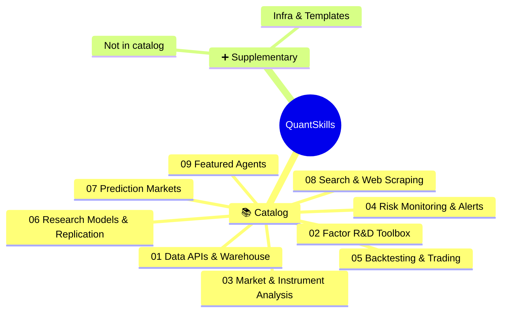
```mermaid
mindmap
  root((QuantSkills))
    📚 Catalog
      01 Data APIs & Warehouse
      02 Factor R&D Toolbox
      03 Market & Instrument Analysis
      04 Risk Monitoring & Alerts
      05 Backtesting & Trading
      06 Research Models & Replication
      07 Prediction Markets
      08 Search & Web Scraping
      09 Featured Agents
    ➕ Supplementary
      Not in catalog
      Infra & Templates
```

## 📑 Contents
- [01 Data APIs & Warehouse](#cat-01)
- [02 Factor R&D Toolbox](#cat-02)
- [03 Market & Instrument Analysis](#cat-03)
- [04 Risk Monitoring & Alerts](#cat-04)
- [05 Backtesting & Trading](#cat-05)
- [06 Research Models & Replication](#cat-06)
- [07 Prediction Markets](#cat-07)
- [08 Search & Web Scraping](#cat-08)
- [09 Featured Agents](#cat-09)
- [📦 Repos not in catalog](#uncat)
- [🧱 Infra & Templates](#infra)

## 01 Data APIs & Warehouse

| Project | Description | Screenshot |
|---|---|---|
| [skill-pandadata-warehouse](https://github.com/quantskills/skill-pandadata-warehouse) | Pandadata warehouse skill for caching, refreshing, querying, and validating local DuckDB and Parquet market-data stores. | <a href="https://raw.githubusercontent.com/quantskills/quantskills/main/assets/skill-pandadata-warehouse.png">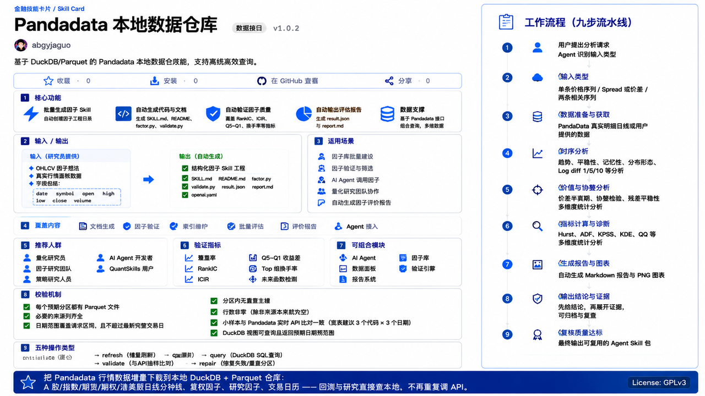</a> |
| [skill-pandadata-api](https://github.com/quantskills/skill-pandadata-api) | Pandadata and panda_data Python SDK reference skill for selecting, calling, and troubleshooting quant data APIs. | — |

## 02 Factor R&D Toolbox

| Project | Description | Screenshot |
|---|---|---|
| [skill-factor-alpha191-alpha101](https://github.com/quantskills/skill-factor-alpha191-alpha101) | Compute Alpha101 and Alpha191 factor values based on JoinQuant formulas with full or selected factor runs. | — |
| [skill-alpha-a06-hotmoney-reversal](https://github.com/quantskills/skill-alpha-a06-hotmoney-reversal) | Use this skill to calculate, validate, backtest, and publish the A06 hot-money seat cooling-reversal and collaborative-breakout Alpha factor for A-share Dragon-Tiger List data. | — |
| [skill-build-b10-factor-evaluation](https://github.com/quantskills/skill-build-b10-factor-evaluation) | The system supports IC/IR calculation, stratified backtesting, monotonicity testing, turnover rate analysis and decay curve plotting for quantitative factor research. | — |
| [skill-factor-optimize](https://github.com/quantskills/skill-factor-optimize) | Optimize an existing stock or futures factor with period sweeps, ablations, refinements, and a final keep-or-replace decision. | — |
| [skill-factormad-debate-factor-mining](https://github.com/quantskills/skill-factormad-debate-factor-mining) | Mine interpretable code-based stock alpha factors from OHLCV market data with a FactorMAD-style LLM debate workflow. | <a href="https://raw.githubusercontent.com/quantskills/quantskills/main/assets/skill-factormad-debate-factor-mining.png">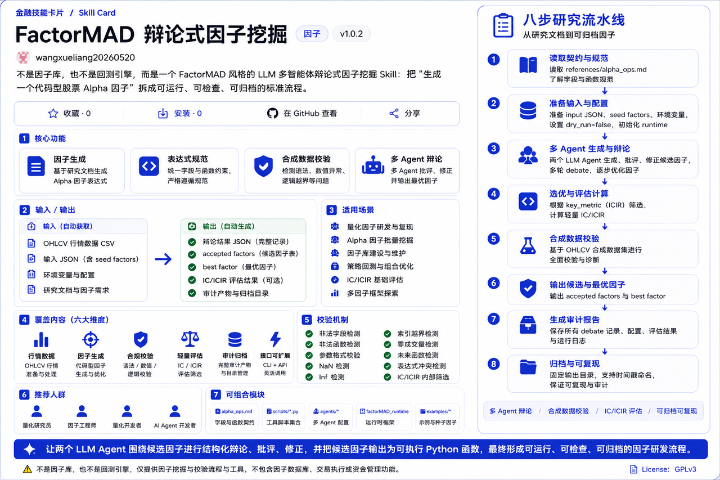</a> |
| [skill-factor-blend](https://github.com/quantskills/skill-factor-blend) | Multi-factor signal-level blending: redundancy removal via correlation matrix and top-bucket overlap, three weighting schemes (equal/ICIR/score), daily cross-sectional z-score synthesis, and composite re-evaluation. Signal-level only — outputs composite_signal, not portfolio weights. | — |
| [skill-factor-decay](https://github.com/quantskills/skill-factor-decay) | Factor decay analysis with multi-horizon Rank IC curves, exponential/power-law/bi-exponential fitting, bootstrap half-life CIs, turnover decay, and Q5-Q1 group-return decay. Recommends optimal rebalancing frequency. Integrated with Pandadata for 5-horizon forward returns. | — |
| [skill-factor-orthogonalize](https://github.com/quantskills/skill-factor-orthogonalize) | Daily cross-sectional OLS orthogonalization against industry one-hot dummies, size (log dollar volume), style (beta, volatility), and legacy factor exposures. Outputs residual signal with exposure-zeroing diagnostics. Integrated with Pandadata for sector classification and style controls. | — |
| [skill-doc-to-alphas](https://github.com/quantskills/skill-doc-to-alphas) | Generate OHLCV alpha factor expressions from document text, with a formula contract and automatic toy-data validation. | <a href="https://raw.githubusercontent.com/quantskills/quantskills/main/assets/skill-doc-to-alphas.png">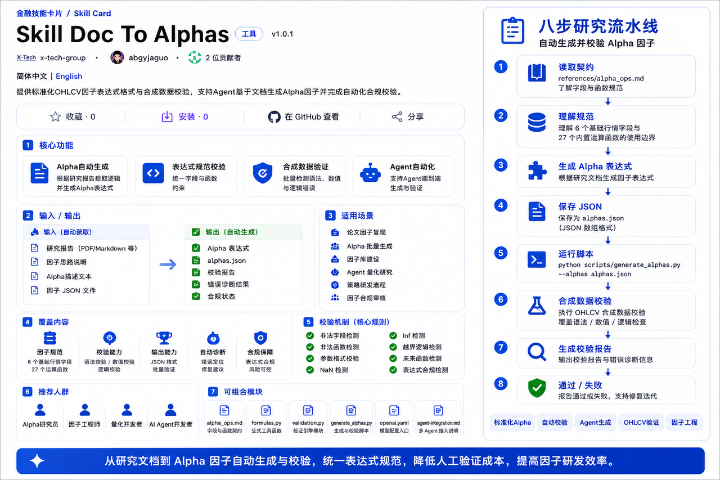</a> |
| [skill-quant-factor-volume-stat-alpha](https://github.com/quantskills/skill-quant-factor-volume-stat-alpha) | Volume, volume-price, ranking, and statistical OHLCV alpha factor library with 216 factor Skills validated on real market data. | <a href="https://raw.githubusercontent.com/quantskills/quantskills/main/assets/skill-quant-factor-volume-stat-alpha.png">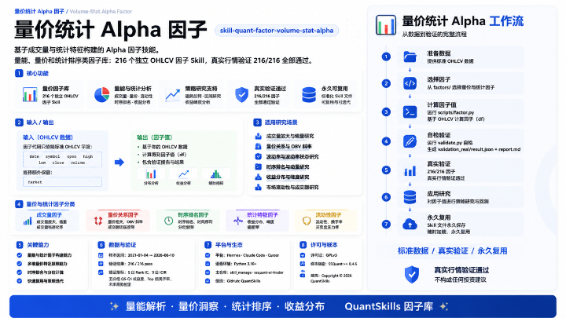</a> |
| [skill-quant-factor-skill-factory](https://github.com/quantskills/skill-quant-factor-skill-factory) | Factory skill for turning OHLCV alpha ideas into QuantSkills factor skills with real-market validation and packaging. | <a href="https://raw.githubusercontent.com/quantskills/quantskills/main/assets/skill-quant-factor-skill-factory.png">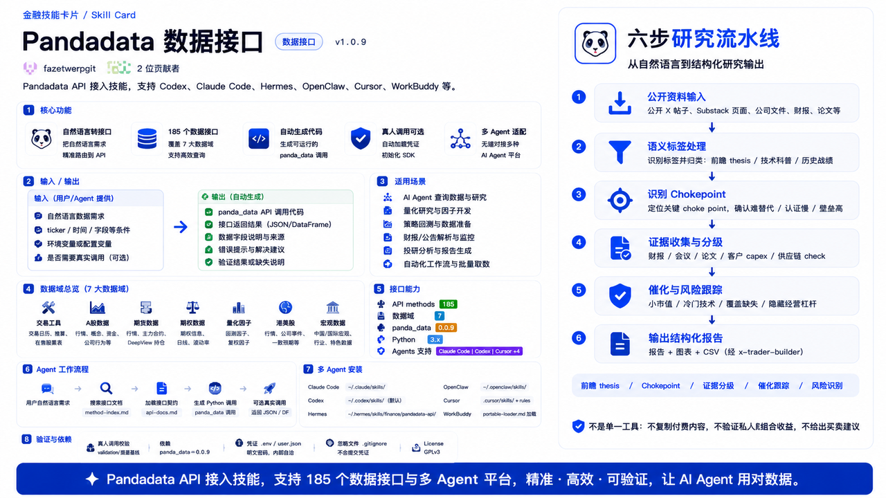</a> |
| [skill-quant-factor-risk-pattern-alpha](https://github.com/quantskills/skill-quant-factor-risk-pattern-alpha) | Risk-state and chart-pattern OHLCV alpha factor library with 288 factor Skills for volatility, K-line shape, shock, drawdown, and pressure analysis. | <a href="https://raw.githubusercontent.com/quantskills/quantskills/main/assets/skill-quant-factor-risk-pattern-alpha.png">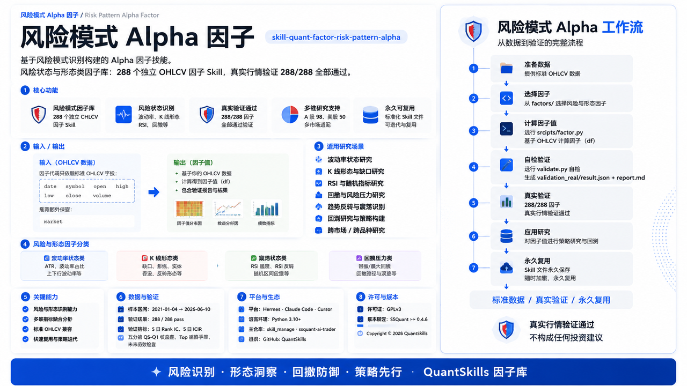</a> |
| [skill-quant-factor-directional-alpha](https://github.com/quantskills/skill-quant-factor-directional-alpha) | Directional OHLCV alpha factor library with 296 trend, breakout, reversal, and channel-position factor Skills validated on real market data. | <a href="https://raw.githubusercontent.com/quantskills/quantskills/main/assets/skill-quant-factor-directional-alpha.png">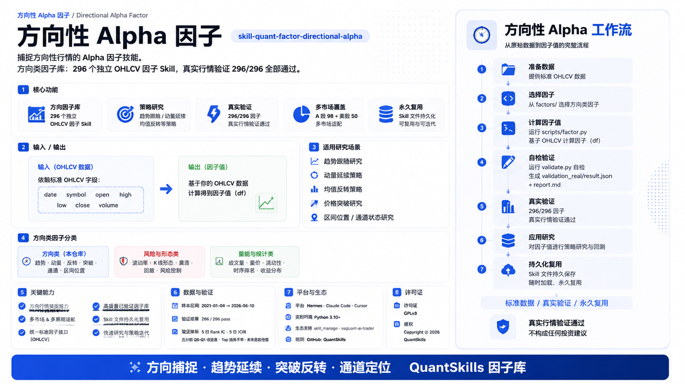</a> |
| [skill-ic-analysis](https://github.com/quantskills/skill-ic-analysis) | Multidimensional IC diagnostics for rank versus Pearson IC, IC decay, subsample IC, top-basket stability, and cumulative IC timelines. | <a href="https://raw.githubusercontent.com/quantskills/quantskills/main/assets/skill-ic-analysis.png">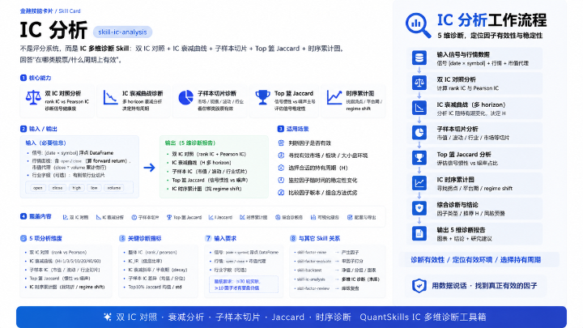</a> |
| [skill-factor-review](https://github.com/quantskills/skill-factor-review) | Factor-library review skill for experiment logs, acceptance rates, score dynamics, factor-family structure, correlations, and research recommendations. | <a href="https://raw.githubusercontent.com/quantskills/quantskills/main/assets/skill-factor-review.png">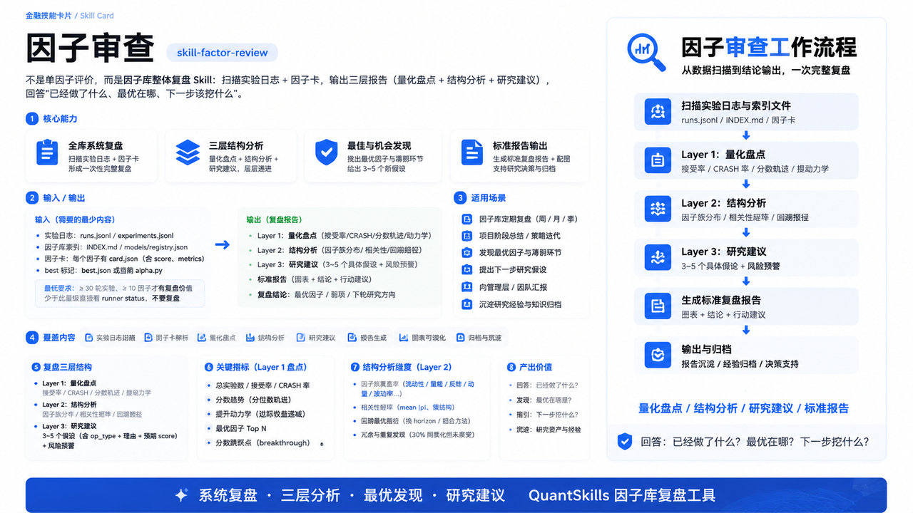</a> |
| [skill-factor-mine](https://github.com/quantskills/skill-factor-mine) | Disciplined factor-mining workflow for hypothesis design, implementation, validation, iteration notes, acceptance, and rollback decisions. | <a href="https://raw.githubusercontent.com/quantskills/quantskills/main/assets/skill-factor-mine.png">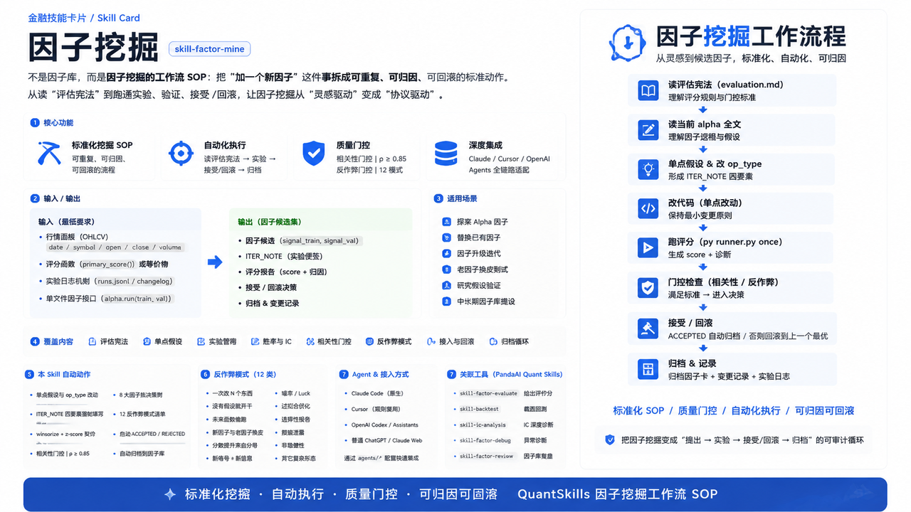</a> |
| [skill-factor-evaluate](https://github.com/quantskills/skill-factor-evaluate) | Single-factor evaluation skill covering rank IC, Pearson IC, Sharpe, drawdown, monotonicity, turnover, and composite scoring. | <a href="https://raw.githubusercontent.com/quantskills/quantskills/main/assets/skill-factor-evaluate.png">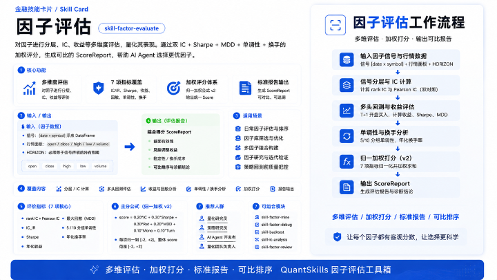</a> |
| [skill-factor-debug](https://github.com/quantskills/skill-factor-debug) | Factor debugging playbook for NaNs, signal validation failures, look-ahead bias, horizon mismatch, checksum drift, and correlation violations. | <a href="https://raw.githubusercontent.com/quantskills/quantskills/main/assets/skill-factor-debug.png">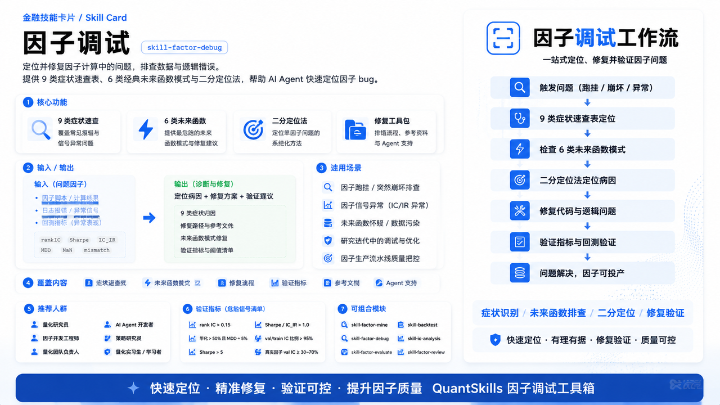</a> |

## 03 Market & Instrument Analysis

| Project | Description | Screenshot |
|---|---|---|
| [skill-a1-lhb-tracking](https://github.com/quantskills/skill-a1-lhb-tracking) | A-share LHB event-ranking factor using seat win rate, payoff, premium, and buy-size evidence from Pandadata. | — |
| [skill-xingtai-catcher](https://github.com/quantskills/skill-xingtai-catcher) | PatternCatcher MCP skill for similar K-line stock and futures search | — |
| [skill-stock-screener](https://github.com/quantskills/skill-stock-screener) | Natural-language A-share stock screener skill that maps fundamentals, dividends, valuation, pledges, northbound flows, sectors, holders, and risk filters to Pandadata calls. | <a href="https://raw.githubusercontent.com/quantskills/quantskills/main/assets/skill-stock-screener.png">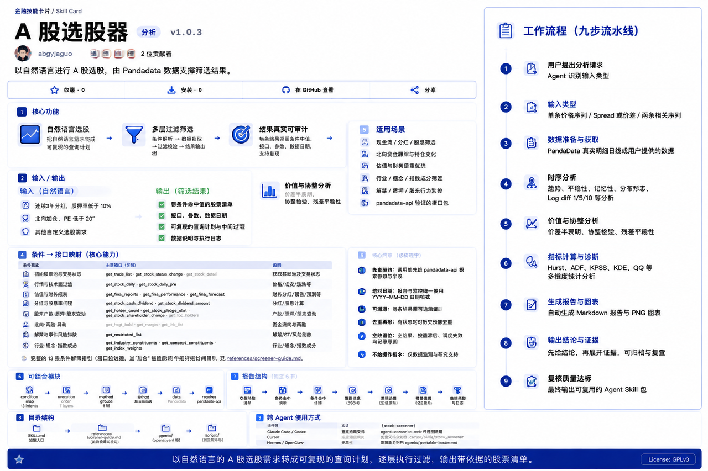</a> |
| [skill-options-vol-analyst](https://github.com/quantskills/skill-options-vol-analyst) | Options volatility analyst skill for option chains, implied volatility, realized volatility, IV percentiles, term structure, skew, and volatility-premium reports. | <a href="https://raw.githubusercontent.com/quantskills/quantskills/main/assets/skill-options-vol-analyst.png">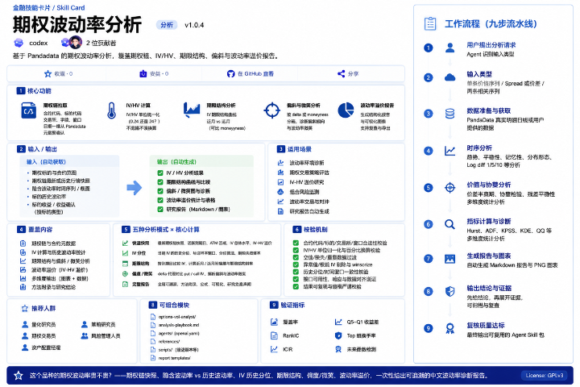</a> |
| [skill-market-daily-review](https://github.com/quantskills/skill-market-daily-review) | A-share end-of-day review skill covering indexes, valuation, breadth, sentiment, sectors, themes, and capital-flow clues. | <a href="https://raw.githubusercontent.com/quantskills/quantskills/main/assets/skill-market-daily-review.png">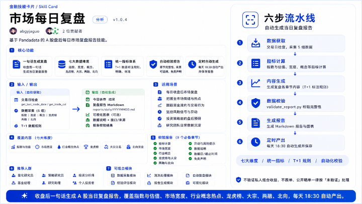</a> |
| [skill-macro-monitor](https://github.com/quantskills/skill-macro-monitor) | Macro monitoring skill for Pandadata macro data, economic calendars, industry prosperity, and high-frequency signals. | — |
| [skill-index-valuation-rotation](https://github.com/quantskills/skill-index-valuation-rotation) | Index valuation and A-share industry rotation skill for PE/PB percentiles, valuation temperature, broad-index references, momentum ranks, and rotation summaries. | <a href="https://raw.githubusercontent.com/quantskills/quantskills/main/assets/skill-index-valuation-rotation.png">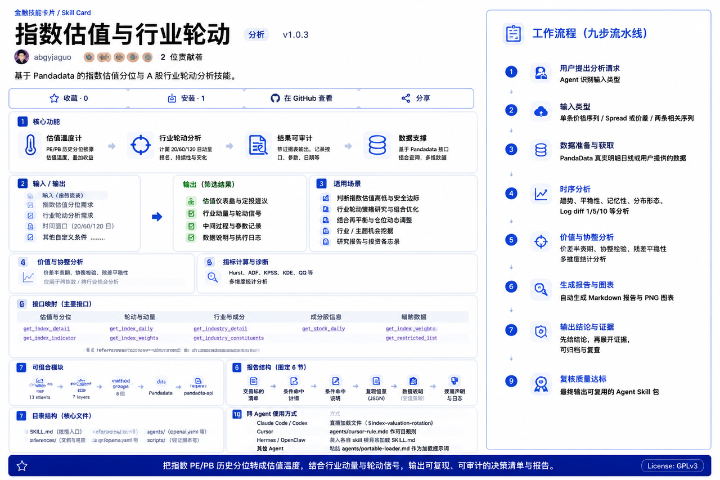</a> |
| [skill-futures-deepview-analyst](https://github.com/quantskills/skill-futures-deepview-analyst) | Futures DeepView analyst skill for position seats, basis, inventory, term structure, and calendar-spread signals from Pandadata. | — |
| [skill-a-share-stock-dossier](https://github.com/quantskills/skill-a-share-stock-dossier) | A-share stock dossier skill that uses Pandadata to produce company, financial, dividend, shareholder, and risk analysis. | <a href="https://raw.githubusercontent.com/quantskills/quantskills/main/assets/skill-a-share-stock-dossier.png">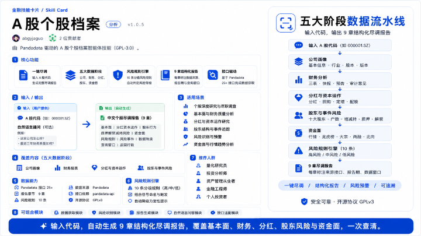</a> |

## 04 Risk Monitoring & Alerts

| Project | Description | Screenshot |
|---|---|---|
| [skill-event-risk-alert](https://github.com/quantskills/skill-event-risk-alert) | A-share event-risk alert skill for watchlists, holdings, unlocks, pledges, reductions, ST changes, forecasts, audit opinions, and traceable reports. | <a href="https://raw.githubusercontent.com/quantskills/quantskills/main/assets/skill-event-risk-alert.png">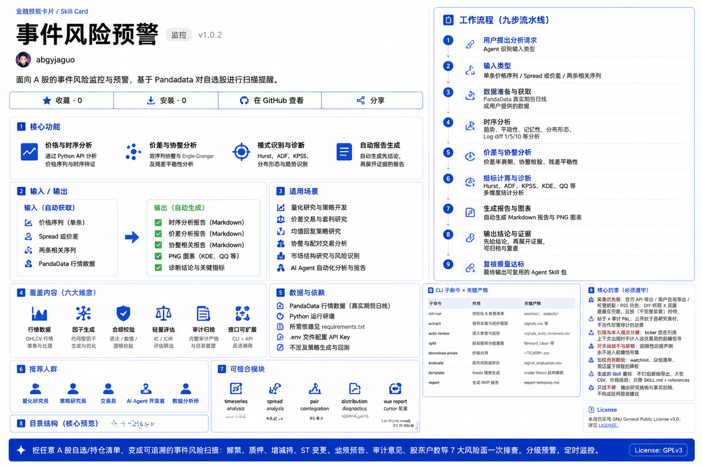</a> |

## 05 Backtesting & Trading

| Project | Description | Screenshot |
|---|---|---|
| [skill-x-trader-builder](https://github.com/quantskills/skill-x-trader-builder) | Skill-builder workflow for turning public X/Twitter data and user materials into trader-specific research-model skills. | <a href="https://raw.githubusercontent.com/quantskills/quantskills/main/assets/skill-x-trader-builder.png">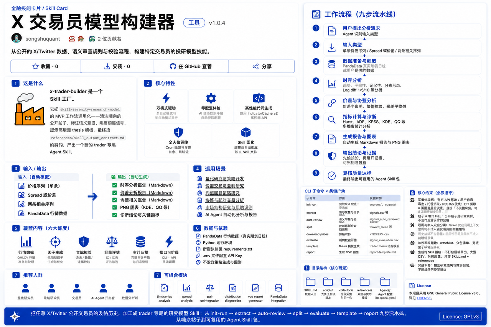</a> |
| [skill-ssquant-trader-generator](https://github.com/quantskills/skill-ssquant-trader-generator) | Trader-generator skill that turns natural-language trading ideas into deployable AI Trader rules, code, and operating plans. | — |
| [skill-ssquant-ai-trader](https://github.com/quantskills/skill-ssquant-ai-trader) | SSQuant AI Trader skill for converting natural-language trading descriptions into automated or semi-automated strategy workflows. | <a href="https://raw.githubusercontent.com/quantskills/quantskills/main/assets/skill-ssquant-ai-trader.png">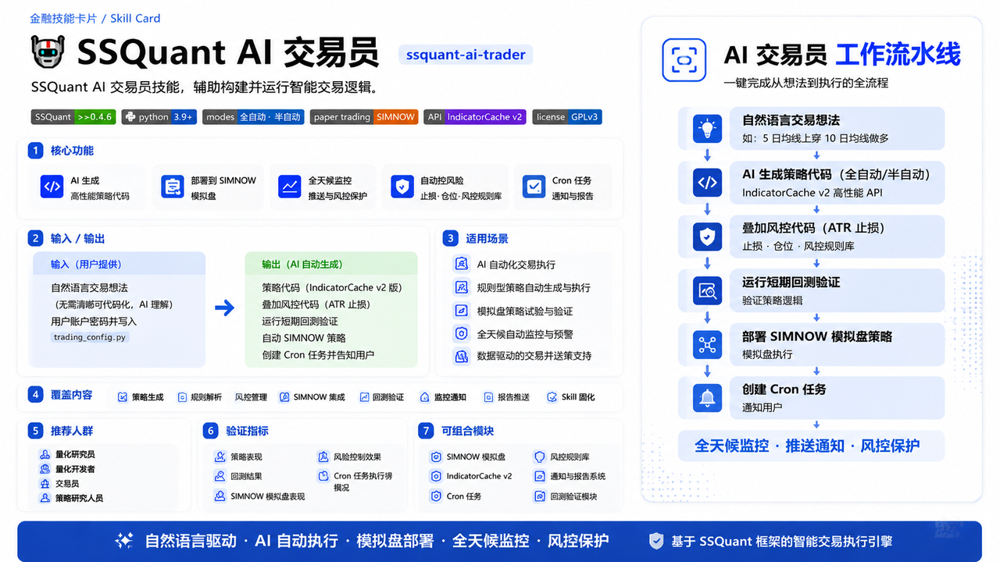</a> |
| [skill-backtest](https://github.com/quantskills/skill-backtest) | Standard cross-sectional long-only backtest protocol with T+1 execution, fees, limit filters, NAV curves, IC, drawdown, and diagnostic charts. | <a href="https://raw.githubusercontent.com/quantskills/quantskills/main/assets/skill-backtest.png">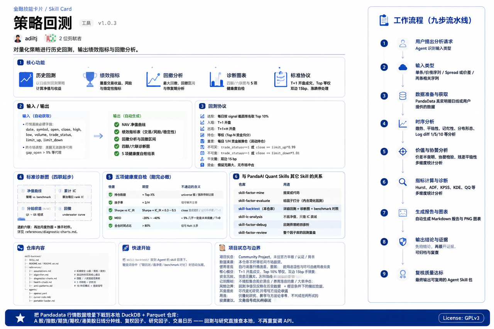</a> |

## 06 Research Models & Replication

| Project | Description | Screenshot |
|---|---|---|
| [skill-report-replication](https://github.com/quantskills/skill-report-replication) | Quant report replication skill that turns papers or reports into Chinese translations, factor formulas, Pandadata-backed validation reports, and strategy assets. | <a href="https://raw.githubusercontent.com/quantskills/quantskills/main/assets/skill-report-replication.png">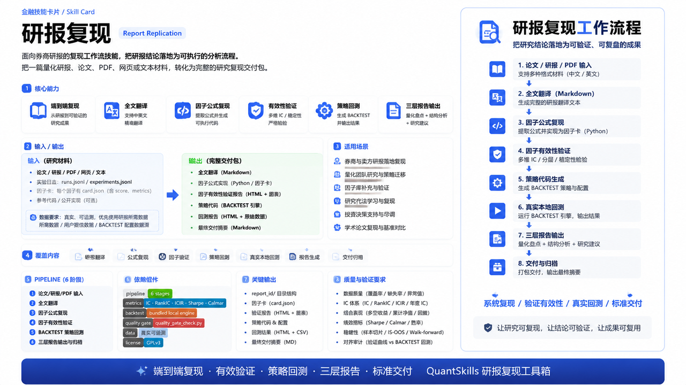</a> |
| [skill-serenity-research-model](https://github.com/quantskills/skill-serenity-research-model) | Research-model skill for reconstructing Serenity-style AI, semiconductor, and supply-chain theses from public posts and datasets. | <a href="https://raw.githubusercontent.com/quantskills/quantskills/main/assets/skill-serenity-research-model.png">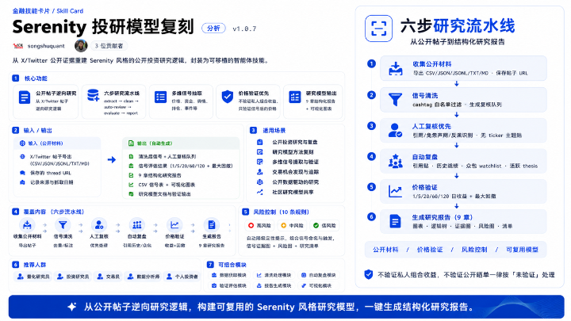</a> |
| [skill-quant-research-replication](https://github.com/quantskills/skill-quant-research-replication) | Quant research replication skill for source discovery, formula reconstruction, Chinese summaries, validation, and deliverables. | <a href="https://raw.githubusercontent.com/quantskills/quantskills/main/assets/skill-quant-research-replication.png">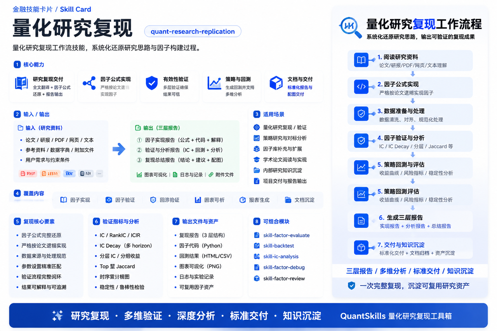</a> |
| [skill-paper-replication](https://github.com/quantskills/skill-paper-replication) | Framework-neutral quantitative paper replication skill for research scripts, backtests, charts, and auditable outputs. | <a href="https://raw.githubusercontent.com/quantskills/quantskills/main/assets/skill-paper-replication.png">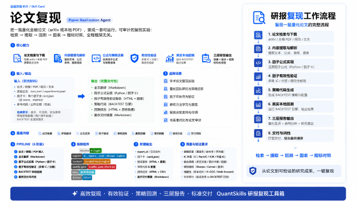</a> |
| [skill-gaetano-crux-capital-research-model](https://github.com/quantskills/skill-gaetano-crux-capital-research-model) | Research-model skill for public-material analysis of photonics, optical networking, Physical AI, and AI infrastructure themes. | <a href="https://raw.githubusercontent.com/quantskills/quantskills/main/assets/skill-gaetano-crux-capital-research-model.png">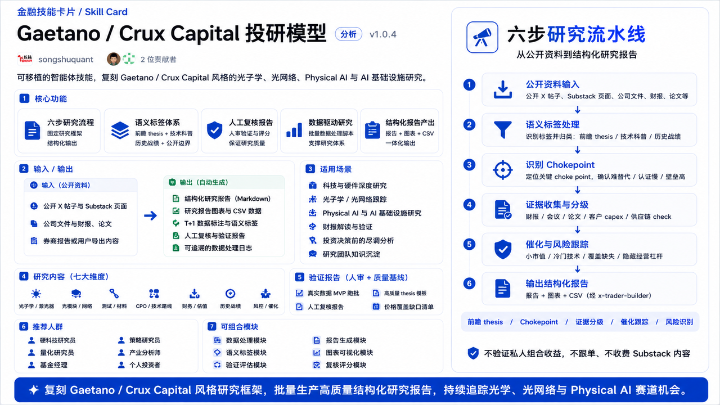</a> |
| [skill-time-series-analysis](https://github.com/quantskills/skill-time-series-analysis) | Conclusion-first time-series diagnostics for original series, Log diff, distributions, stationarity, cointegration, and half-life. | <a href="https://raw.githubusercontent.com/quantskills/quantskills/main/assets/skill-time-series-analysis.png">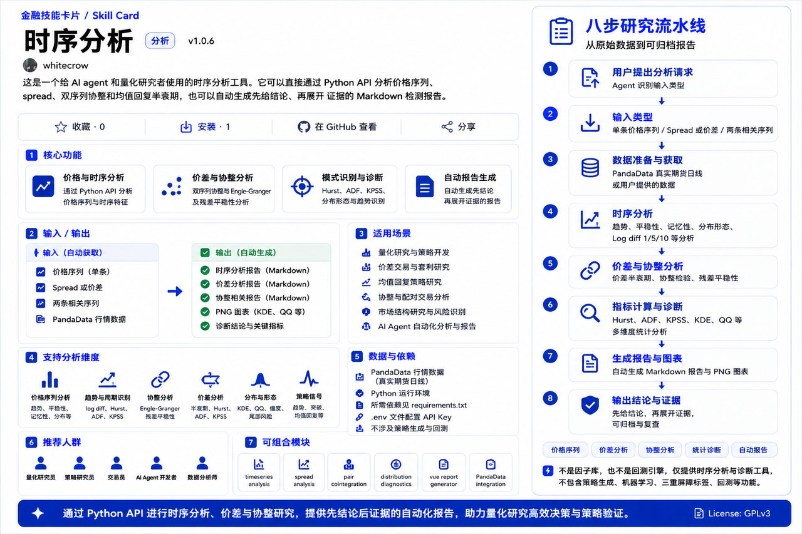</a> |

## 07 Prediction Markets

> 🔒 Reserved category — no repos yet.

## 08 Search & Web Scraping

> 🔒 Reserved category — no repos yet.

## 09 Featured Agents

| Project | Description | Screenshot |
|---|---|---|
| [agent-for-liangshuyuan-tasks](https://github.com/quantskills/agent-for-liangshuyuan-tasks) | 量枢学院多 Agent 协作框架——基于 Claude Code 的量化交易工具开发平台，将任务需求自动分析、路由、开发、测试、发布全流程自动化。内置 6 个专业 Agent，支持 BUILD 工具与 Alpha 因子的 Skill 架构开发。 | — |
| [agent-ssquant](https://github.com/quantskills/agent-ssquant) | SSQuant Agent workflow for futures strategies, data services, CTP gates, and Chinese reports. | — |
| [agent-quantspace](https://github.com/quantskills/agent-quantspace) | AI-native quantitative research framework for reusable skills, strategy workflows, backtests, and reports. | <a href="https://raw.githubusercontent.com/quantskills/quantskills/main/assets/agent-quantspace.png">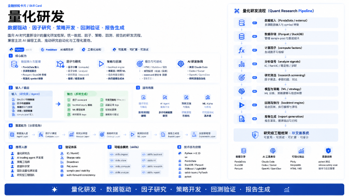</a> |
| [agent-market-regime-monitor](https://github.com/quantskills/agent-market-regime-monitor) | Monitor market regime from Pandadata index, breadth, volatility, and funding evidence. | <a href="https://raw.githubusercontent.com/quantskills/quantskills/main/assets/agent-market-regime-monitor.png">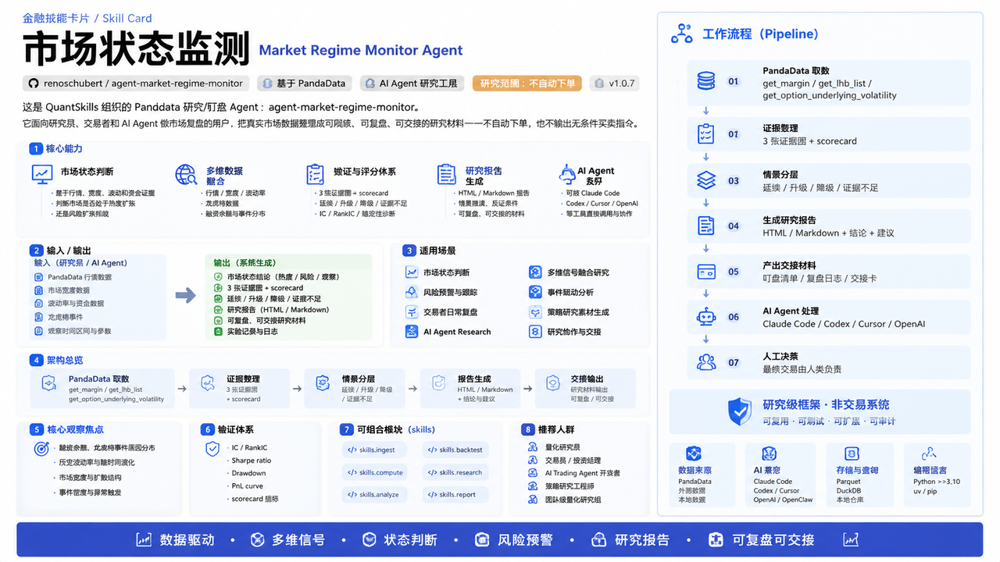</a> |
| [agent-derivatives-skew-sentiment-monitor](https://github.com/quantskills/agent-derivatives-skew-sentiment-monitor) | Monitor derivatives sentiment from option implied volatility and underlying historical volatility. | <a href="https://raw.githubusercontent.com/quantskills/quantskills/main/assets/agent-derivatives-skew-sentiment-monitor.png">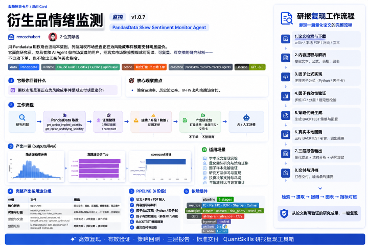</a> |
| [agent-crowding-risk-monitor](https://github.com/quantskills/agent-crowding-risk-monitor) | Monitor crowded-trade risk from Pandadata price, turnover, margin, and LHB heat evidence. | <a href="https://raw.githubusercontent.com/quantskills/quantskills/main/assets/agent-crowding-risk-monitor.png">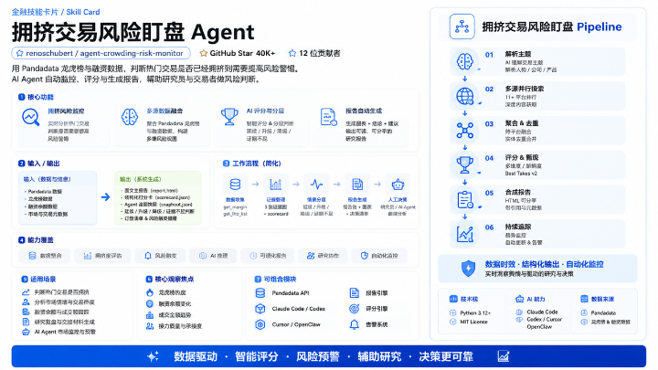</a> |
| [agent-correlation-break-research](https://github.com/quantskills/agent-correlation-break-research) | Detect correlation breaks, style shifts, and diversification stress from Pandadata return evidence. | <a href="https://raw.githubusercontent.com/quantskills/quantskills/main/assets/agent-correlation-break-research.png">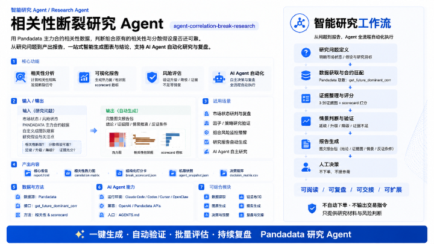</a> |

---

## 📦 Repos not in catalog
Repos not in the Feishu catalog (raw factors, BUILD skills, and other non skill-/agent- repos).

| Project | Description | Screenshot |
|---|---|---|
| [skill-smart-money-profiler](https://github.com/quantskills/skill-smart-money-profiler) | Identify the capital actors behind A-share trades and profile their cross-period behavior using Pandadata seat, northbound, margin, and block-trade data. | — |
| [skill-portfolio-checkup](https://github.com/quantskills/skill-portfolio-checkup) | Portfolio-level checkup skill that uses Pandadata to aggregate single-stock signals into portfolio structure, concentration, weighted valuation/quality, risk exposure, and benchmark deviation. | — |
| [skill-earnings-season-tracker](https://github.com/quantskills/skill-earnings-season-tracker) | Whole-market A-share earnings-season scanner covering forecast-type distribution, beat/miss leaders, industry earnings prosperity, and audit-opinion watchlists. | — |
| [skill-backtest-overfit](https://github.com/quantskills/skill-backtest-overfit) | Detect backtest overfitting and selection bias from multiple testing. Use when a user has a backtest / factor result and asks whether the Sharpe is real, whether a strategy is overfit, or wants to validate results... | — |
| [skill-portfolio-optimize](https://github.com/quantskills/skill-portfolio-optimize) | Turn an alpha signal into optimal portfolio weights under real constraints. Use when a user has factor scores / expected returns and wants portfolio weights, or asks about mean-variance / risk-parity / minimum-variance... | — |
| [skill-risk-model](https://github.com/quantskills/skill-risk-model) | Build a Barra-style structural multi-factor risk model and attribute portfolio risk. Use when a user wants a covariance matrix for optimisation, asks how risky a portfolio is, where its risk comes from (which factors /... | — |

## 🧱 Infra & Templates
Governance, scaffolding and templates (incl. the quantskills nav repo).

| Project | Description | Screenshot |
|---|---|---|
| [registry](https://github.com/quantskills/registry) | Public display registry for QUANTSKILLS skill-* and agent-* assets. | — |
| [quantskills](https://github.com/quantskills/quantskills) | QuantSkills组织的全景导航 ——Panoramic navigator for the QuantSkills organization | — |
| [.github](https://github.com/quantskills/.github) | — | — |
| [skill-template](https://github.com/quantskills/skill-template) | Template repository for QUANTSKILLS skill-* projects. | — |
| [join](https://github.com/quantskills/join) | — | — |
| [agent-template](https://github.com/quantskills/agent-template) | Template repository for QUANTSKILLS agent-* projects. | — |

---
## 🐼 PandaAI Community

  
   
  Scan to join the PandaAI community for QUANTSKILLS skills, agent workflows, and quant research.

