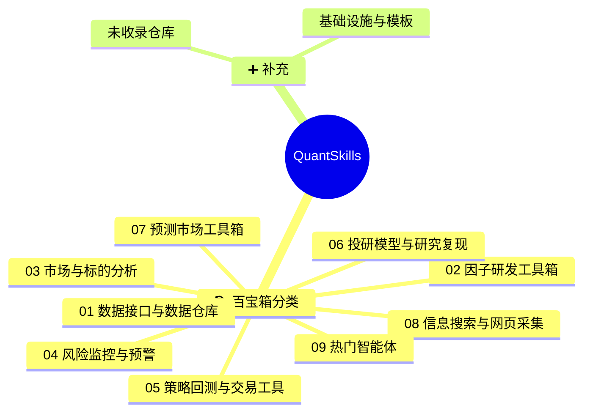

<!-- 本文件由 scripts/build.mjs 自动生成，请勿手工编辑。Generated file — do not edit by hand. -->
# 🧭 quantskills
> QuantSkills 组织全景导航 · 量化技能 / 因子 / Agent 一站式可点击索引，图文并茂。

**简体中文** | [English](README.en.md)

   

**QUANTSKILLS** 是 AI Agent 时代的开放量化社区，聚焦 **Quant Skills（量化技能）** 与 **Agents（智能体）** 两类资产。由 [PandaAI](https://www.pandaaiquant.com/) 发起，帮助量化开发者把交易经验、研究方法、因子模型与策略代码，转化为**可检索、可安装、可验证、可分享**的标准化资产。

> 把你的量化经验，变成人类可以信任、AI Agent 可以调用的 Skill。

## 🗺️ 全景总览

## 📑 目录
- [01 数据接口与数据仓库](#cat-01)
- [02 因子研发工具箱](#cat-02)
- [03 市场与标的分析](#cat-03)
- [04 风险监控与预警](#cat-04)
- [05 策略回测与交易工具](#cat-05)
- [06 投研模型与研究复现](#cat-06)
- [07 预测市场工具箱](#cat-07)
- [08 信息搜索与网页采集](#cat-08)
- [09 热门智能体](#cat-09)
- [📦 未收录仓库](#uncat)
- [🧱 基础设施与模板](#infra)

## 01 数据接口与数据仓库

| 项目 | 说明 | 截图 |
|---|---|---|
| [skill-us-sec-edgar-harvester](https://github.com/quantskills/skill-us-sec-edgar-harvester) | 抓取并结构化美股 SEC EDGAR 公开文件（8-K/Form 4/13D-G/13F/S-1），去重、标注来源与时间线。 | — |
| [skill-pandadata-warehouse](https://github.com/quantskills/skill-pandadata-warehouse) | Pandadata 本地数据仓库：用 DuckDB 与 Parquet 缓存、增量刷新、查询和校验行情数据，减少重复 API 调用。 |  |
| [skill-pandadata-api](https://github.com/quantskills/skill-pandadata-api) | 把自然语言数据需求，精准路由到正确的 pandadata API，并生成可直接运行的 Python 调用。 | — |
| [skill-fundamental-factor-analysis](https://github.com/quantskills/skill-fundamental-factor-analysis) | 计算、验证和分析A股基本面因子。覆盖估值(EP/BP/SP/CP/FCFP/GP/A)、质量(ROE/ROA/毛利率/应计利润/杠杆)、成长(盈利增长/营收增长/分析师预期调整)和复合因子。使用Pandadata财务API获取数据，通过IC分析、分组收益、Fama-MacBeth回归进行因子验证 | — |

## 02 因子研发工具箱

| 项目 | 说明 | 截图 |
|---|---|---|
| [skill-templeton-global-contrarian](https://github.com/quantskills/skill-templeton-global-contrarian) | 邓普顿逆向全球价值因子，A股/港股/美股跨市场估值偏离度筛选 | — |
| [skill-quant-factor-volume-stat-alpha](https://github.com/quantskills/skill-quant-factor-volume-stat-alpha) | 量能、量价和统计排序类因子库：216 个独立 OHLCV 因子 Skill，真实行情验证 216/216 全部通过。 |  |
| [skill-quant-factor-skill-factory](https://github.com/quantskills/skill-quant-factor-skill-factory) | 不是因子库本身，而是继续生产因子库的工具：批量生成、验证和打包框架中立的 OHLCV 量化因子 Skill。 |  |
| [skill-quant-factor-risk-pattern-alpha](https://github.com/quantskills/skill-quant-factor-risk-pattern-alpha) | 风险状态与形态类因子库：288 个独立 OHLCV 因子 Skill，真实行情验证 288/288 全部通过。 |  |
| [skill-quant-factor-directional-alpha](https://github.com/quantskills/skill-quant-factor-directional-alpha) | 方向类因子库：296 个独立 OHLCV 因子 Skill，真实行情验证 296/296 全部通过。 |  |
| [skill-overseas-equity-factor-miner](https://github.com/quantskills/skill-overseas-equity-factor-miner) | 在港美股上发现并校验横截面 alpha 因子：生成候选、计算、按 IC/衰减/换手排名。 | — |
| [skill-ic-analysis](https://github.com/quantskills/skill-ic-analysis) | 不是评分系统，而是IC 多维诊断 Skill：双 IC 对照 + IC 衰减曲线 + 子样本切片 + Top 篮 Jaccard + 时序累计图。回答"在哪类股票/什么周期上有效"。 |  |
| [skill-factormad-debate-factor-mining](https://github.com/quantskills/skill-factormad-debate-factor-mining) | 使用 FactorMAD 风格的 LLM 多智能体辩论流程从 OHLCV 行情数据中挖掘代码型股票 Alpha 因子。 |  |
| [skill-factor-review](https://github.com/quantskills/skill-factor-review) | 不是单因子评价，而是因子库整体复盘 Skill：扫描实验日志 + 因子卡，输出三层报告（量化盘点 + 结构分析 + 研究建议），回答"已经做了什么、最优在哪、下一步该挖什么"。 |  |
| [skill-factor-pool-evolution](https://github.com/quantskills/skill-factor-pool-evolution) | Run one round of factor-pool recommendation from an existing stock alpha set. Use when an agent needs to start from user-provided seed factors, prepare... | — |
| [skill-factor-orthogonalize](https://github.com/quantskills/skill-factor-orthogonalize) | 逐日截面 OLS 正交化：剥离行业(L1 one-hot) + 市值(log_dollar_vol) + 风格(beta/volatility) + 旧因子暴露，输出残差因子与暴露清零诊断报告。已对接 Pandadata 获取行业分类(sector_code_name)和风格控制变量。 | — |
| [skill-factor-optimize](https://github.com/quantskills/skill-factor-optimize) | 对已有股票或期货因子做参数扫描、组件消融和核心版本增强，并输出是否替换原因子的结论。 | — |
| [skill-factor-mine](https://github.com/quantskills/skill-factor-mine) | 不是因子库，而是因子挖掘的工作流 SOP：把"加一个新因子"这件事拆成可重复、可归因、可回滚的标准动作。 |  |
| [skill-factor-evaluate](https://github.com/quantskills/skill-factor-evaluate) | 不是回测引擎，而是给单个因子打综合分的评价 Skill：双 IC + Sharpe + MDD + 单调性 + 换手 → 归一加权主分。 |  |
| [skill-factor-decay](https://github.com/quantskills/skill-factor-decay) | 因子衰减分析：多期限 Rank IC 衰减曲线 → 指数/幂律/双指数拟合 → Bootstrap 半衰期置信区间 → 换手衰减 + Q5-Q1 分组收益衰减 → 推荐最优再平衡频率。已对接 Pandadata 计算 1d/3d/5d/10d/20d 五期限 forward returns。 | — |
| [skill-factor-debug](https://github.com/quantskills/skill-factor-debug) | 不是 IDE 调试器，而是因子崩溃 / 失效 / 数值异常的诊断手册：按"症状 → 候选病因 → 验证手段"组织的 9 类速查表，专治"因子跑挂"和"看似太好怀疑有 bug"。 |  |
| [skill-factor-blend](https://github.com/quantskills/skill-factor-blend) | 多因子信号层合并：去冗余（相关矩阵 + Top-bucket overlap）→ 等权/ICIR/Score 三种加权方案 → 逐日截面 z-score 合成 → 重新评价复合因子。信号层操作（产出 composite_signal），非组合层资金分配。 | — |
| [skill-factor-alpha191-alpha101](https://github.com/quantskills/skill-factor-alpha191-alpha101) | 参考 JoinQuant 公式计算 Alpha101 和 Alpha191 因子值，支持全量和指定因子运行。 | — |
| [skill-doc-to-alphas](https://github.com/quantskills/skill-doc-to-alphas) | 从文档文本生成 OHLCV alpha 因子表达式，并提供公式契约与玩具数据自动验证。 |  |
| [skill-alpha-a06-hotmoney-reversal](https://github.com/quantskills/skill-alpha-a06-hotmoney-reversal) | Use this skill to calculate, validate, backtest, and publish the A06 hot-money seat cooling-reversal and collaborative-breakout Alpha factor for A-share... | — |
| [skill-alpha-f5-member-position-concentration](https://github.com/quantskills/skill-alpha-f5-member-position-concentration) | Use when researching or validating the F5 commodity futures member-position concentration factor in a local Panda data environment. | — |
| [skill-alpha-f6-family-position-reverse](https://github.com/quantskills/skill-alpha-f6-family-position-reverse) | Use when researching or validating the F6 commodity futures family-position reverse factor in a local Panda data environment. | — |
| [skill-alpha-f8-family-main-divergence](https://github.com/quantskills/skill-alpha-f8-family-main-divergence) | Use when researching or validating the F8 commodity futures broker-position divergence factor in a local Panda data environment. | — |
| [skill-build-b10-factor-evaluation](https://github.com/quantskills/skill-build-b10-factor-evaluation) | The system supports IC/IR calculation, stratified backtesting, monotonicity testing, turnover rate analysis and decay curve plotting for quantitative factor research. | — |

## 03 市场与标的分析

| 项目 | 说明 | 截图 |
|---|---|---|
| [skill-stock-screener](https://github.com/quantskills/skill-stock-screener) | 自然语言 A 股选股：把分红、估值、质押、北向、行业概念、财务增长、股东变化等条件转成可追溯 Pandadata 筛选。 |  |
| [skill-smart-money-profiler](https://github.com/quantskills/skill-smart-money-profiler) | 追踪"谁在买卖"以及"他们一贯怎么做"：龙虎榜席位身份识别与画像档案、北向资金跨期行为、北向×机构×融资×大宗的多源资金合力与分歧，输出可溯源的资金主体行为画像报告。 | — |
| [skill-portfolio-checkup](https://github.com/quantskills/skill-portfolio-checkup) | 输入一个持仓组合清单（代码+权重/市值），输出组合层级的体检报告：结构与集中度、估值与财务质量分布、风险敞口聚合（解禁/质押/减持/ST）、基准偏离与资金面。 | — |
| [skill-options-vol-analyst](https://github.com/quantskills/skill-options-vol-analyst) | 期权波动率分析：期权链快照、隐含波动率、历史/实现波动率、IV 分位、期限结构、偏度与波动率溢价报告。 |  |
| [skill-market-daily-review](https://github.com/quantskills/skill-market-daily-review) | 收盘后一句话生成 A 股当日复盘：指数与估值、市场宽度、行业概念热点、龙虎榜、大宗、两融、北向 —— 每个数字可溯源，支持定时自动生成。 |  |
| [skill-macro-monitor](https://github.com/quantskills/skill-macro-monitor) | 把"查 CPI""本周有什么经济数据""钢铁行业景气度怎么样"这类请求，路由到正确的 Pandadata getmacro 接口，输出带数据时效标注的中文宏观分析与定期监控。 | — |
| [skill-index-valuation-rotation](https://github.com/quantskills/skill-index-valuation-rotation) | 指数估值与行业轮动分析：PE/PB 分位、估值温度、宽基定投参考、行业动量排名与轮动摘要。 |  |
| [skill-global-macro-rates-fx-lab](https://github.com/quantskills/skill-global-macro-rates-fx-lab) | 用公开 FRED/央行数据与 Pandadata 国际宏观研究全球利率、外汇与宏观周期。 | — |
| [skill-global-commodity-term-structure](https://github.com/quantskills/skill-global-commodity-term-structure) | 用公开数据研究海外商品期货期限结构：contango/backwardation、展期收益、跨期与跨品种价差、库存背景。 | — |
| [skill-gao-shanwen-research-model](https://github.com/quantskills/skill-gao-shanwen-research-model) | Build and apply a Gao Shanwen-style China macro and capital-market research workflow from his books, public articles, and archived materials. | — |
| [skill-futures-deepview-analyst](https://github.com/quantskills/skill-futures-deepview-analyst) | 把"分析螺纹钢席位博弈""看豆粕期限结构和仓单"这类自然语言请求，转成 Pandadata 期货 DeepView 数据调用计划，输出事实与推断分离的中文研判报告。 | — |
| [skill-a1-lhb-tracking](https://github.com/quantskills/skill-a1-lhb-tracking) | 用 pandadata 龙虎榜数据追踪席位胜率、盈亏比和次日溢价，生成事件驱动排序因子。 | — |
| [skill-a-share-stock-dossier](https://github.com/quantskills/skill-a-share-stock-dossier) | 输入一个 A 股代码，输出一份可溯源的中文个股尽调报告：基本面、分红资本运作、股东行为、质押解禁减持风险、资金面，一次查清。 |  |
| [skill-hk-stock-dossier](https://github.com/quantskills/skill-hk-stock-dossier) | 生成结构化港股尽职调查研报，输出为中文 Markdown 研报。 | — |
| [skill-b7-lhb-monitor](https://github.com/quantskills/skill-b7-lhb-monitor) |  | — |
| [skill-xingtai-catcher](https://github.com/quantskills/skill-xingtai-catcher) | PatternCatcher MCP skill for similar K-line stock and futures search | — |

## 04 风险监控与预警

| 项目 | 说明 | 截图 |
|---|---|---|
| [skill-hk-us-insider-radar](https://github.com/quantskills/skill-hk-us-insider-radar) | 港股/美股内部人（董监高/大股东）交易信号雷达：区分公开市场买入与卖出、期权行权/赠与等处置类型，按内部人身份与主要人物标记加权，窗口内净额（股数/金额）聚合，标记聚集买入/卖出与持股变化，按净内部人方向排榜，支持单票或自选清单与定时运行。 | — |
| [skill-event-risk-alert](https://github.com/quantskills/skill-event-risk-alert) | A 股持仓和自选股事件风险预警：解禁、质押、减持、ST、业绩预告、审计意见等事件扫描与可追溯告警报告。 |  |
| [skill-earnings-season-tracker](https://github.com/quantskills/skill-earnings-season-tracker) | 按财报季时间窗对全市场做业绩横截面扫描：预告类型分布、超预期/暴雷榜、行业业绩景气、年报季审计非标清单 —— 每个数据点可溯源，支持财报季定时运行。 | — |
| [skill-block-trade-radar](https://github.com/quantskills/skill-block-trade-radar) | A股大宗交易折溢价雷达：把每笔大宗成交价对齐同日收盘价算折溢价率、读机构专用买卖方向、标记重复折价接盘与同营业部对倒式打款、按成交额与折溢价排榜，支持全市场扫描、单票时间线与定时运行。 | — |

## 05 策略回测与交易工具

| 项目 | 说明 | 截图 |
|---|---|---|
| [skill-dalio-all-weather](https://github.com/quantskills/skill-dalio-all-weather) | Build and audit reproducible, research-only A-share All Weather allocations with PandaData, growth-inflation regimes, inverse-volatility risk budgets,... | — |
| [skill-simons-pairs-trading](https://github.com/quantskills/skill-simons-pairs-trading) | Screen and audit reproducible, research-only A-share pairs with adjusted PandaData prices, same-industry Engle-Granger tests, Benjamini-Hochberg FDR,... | — |
| [skill-factor-ranking-sage](https://github.com/quantskills/skill-factor-ranking-sage) | Rank and select quantitative model factors from local factor and label CSV files with one of two self-contained methods: deterministic regression mRMR using... | — |
| [skill-model-hpo-evidence-driven](https://github.com/quantskills/skill-model-hpo-evidence-driven) | Run evidence-driven or deterministic grid hyperparameter search for quantitative multi-factor models. | — |
| [skill-x-trader-builder](https://github.com/quantskills/skill-x-trader-builder) | 把任意 X/Twitter 公开交易员的发帖历史，加工成 trader 专属的研究模型 Skill：init-run → 采集 → extract → auto-review → split → evaluate → template → report 九步流水线，从噪... |  |
| [skill-ssquant-trader-generator](https://github.com/quantskills/skill-ssquant-trader-generator) | 说一次想法，得到一个可以随时加载的 AI 交易员。 | — |
| [skill-ssquant-ai-trader](https://github.com/quantskills/skill-ssquant-ai-trader) | 你负责说话，AI 负责写代码、跑策略、盯盘、控风险。 |  |
| [skill-risk-model](https://github.com/quantskills/skill-risk-model) | Build a Barra-style structural multi-factor risk model and attribute portfolio risk. | — |
| [skill-portfolio-optimize](https://github.com/quantskills/skill-portfolio-optimize) | Turn an alpha signal into optimal portfolio weights under real constraints. Use when a user has factor scores / expected returns and wants portfolio weights,... | — |
| [skill-pandaai-workflow-generator](https://github.com/quantskills/skill-pandaai-workflow-generator) | 根据用户的自然语言量化想法，自动生成包含 Python 因子/策略代码及完整连线图的 PandaAI 工作流 JSON 文件，支持一键导入官网进行回测。 | — |
| [skill-pandaai-workflow-audit](https://github.com/quantskills/skill-pandaai-workflow-audit) | 像代码评审一样审计 PandaAI 工作流文件，检查图结构、策略与因子代码、数据时序、参数自由度、回测假设和验证证据，逐条给出缺陷、影响与优化方案。 | — |
| [skill-jq-to-panda-converter](https://github.com/quantskills/skill-jq-to-panda-converter) | 将聚宽(JoinQuant)平台策略代码批量转换为PandaAI平台支持的策略代码，理解策略思想而非逐行翻译，支持单文件转换和批量目录转换 | — |
| [skill-global-macro-trend-strategy](https://github.com/quantskills/skill-global-macro-trend-strategy) | 把海外商品/宏观/外汇信号做成框架无关、可回测的研究策略（规则+仓位+风控+回测脚本，仅研究）。 | — |
| [skill-backtest](https://github.com/quantskills/skill-backtest) | 不是回测框架，而是截面多头回测的标准协议：T+1 开盘成交、Top 等权、双边 15bp、涨跌停剔除、四联诊断图、5 项健康度自检。 |  |
| [skill-backtest-overfit](https://github.com/quantskills/skill-backtest-overfit) | Detect backtest overfitting and selection bias from multiple testing. Use when a user has a backtest / factor result and asks whether the Sharpe is real,... | — |
| [skill-qbti](https://github.com/quantskills/skill-qbti) | QBTI 量化行为类型指标：五组趣味问答了解普通人的投资性格，按固定规则表翻译成因子方向与策略参数，再交给因子库和回测流水线，全程大白话解释。 | — |
| [skill-b12-intraday-position-manager](https://github.com/quantskills/skill-b12-intraday-position-manager) | 当需要对日内多品种持仓做动态仓位管理时，使用此 skill。支持 A股/A股ETF/股指期货/商品期货/港股+ETF；区分 T+1/T+0、昨仓/今仓、保证金/现金，输出标准 8 字段调仓指令。 | — |
| [skill-factor-backtest](https://github.com/quantskills/skill-factor-backtest) | — | — |

## 06 投研模型与研究复现

| 项目 | 说明 | 截图 |
|---|---|---|
| [skill-time-series-analysis](https://github.com/quantskills/skill-time-series-analysis) | 结论先行的时序分析 Skill：原始序列、Log diff、分布、平稳性、协整和半衰期。 |  |
| [skill-serenity-research-model](https://github.com/quantskills/skill-serenity-research-model) | 从 Serenity（@aleabitoreddit）的公开 X 帖子里逆向研究逻辑：extract → clean → auto-review → evaluate → report 五段流水线，把帖子拆成最小信号单元，并用价格数据回看公开 call 的后续表现。 |  |
| [skill-report-replication](https://github.com/quantskills/skill-report-replication) | 把一篇量化研报、论文、PDF、网页或文本材料，转化为 Pandadata 真实数据驱动的研究复现交付包：全文翻译 → 因子公式复现 → 有效性验证 → 策略代码 → 真实本地回测 → 交付摘要。 |  |
| [skill-quant-research-replication](https://github.com/quantskills/skill-quant-research-replication) | 搜索或接收量化论文、研报、PDF、网页、文本材料，产出一套完整的研究复现交付包：全文翻译 → 因子公式复现 → 有效性验证 → 策略代码 → 真实本地回测 → 交付摘要。 |  |
| [skill-paper-replication](https://github.com/quantskills/skill-paper-replication) | 把一篇量化金融论文（arXiv 或本地 PDF），变成一套可运行、可审计的复现实验：检索 → 提取 → 回测 → 图表 → 指标对照，全程框架无关。 |  |
| [skill-gaetano-crux-capital-research-model](https://github.com/quantskills/skill-gaetano-crux-capital-research-model) | 基于公开资料复刻 Gaetano / Crux Capital 的研究方法：把公开 X 帖子、公开 Substack 页面、财报与技术论文，拆解成「光子堆栈定位 → chokepoint 识别 → 证据分级 → 催化与风险跟踪」的结构化研究模型。 |  |
| [skill-investment-decision](https://github.com/quantskills/skill-investment-decision) | 输入公司名称或股票代码，基于Yahoo Finance公开数据与网络搜索，输出长期（6-18个月）投资决策报告（买入/中性/卖出+置信度）.docx，含图表与完整数据来源。 | — |

## 07 预测市场工具箱

> 🔒 预留分类，暂无仓库（后续补充）。

## 08 信息搜索与网页采集

> 🔒 预留分类，暂无仓库（后续补充）。

## 09 热门智能体

| 项目 | 说明 | 截图 |
|---|---|---|
| [agent-ssquant](https://github.com/quantskills/agent-ssquant) | SSQuant Agent：期货策略、数据服务、CTP门禁和中文报告工作流。 | — |
| [agent-quantspace](https://github.com/quantskills/agent-quantspace) | AI-native quantitative research framework |  |
| [agent-market-regime-monitor](https://github.com/quantskills/agent-market-regime-monitor) | 用 Pandadata 行情、指数、宽度、波动和资金证据判断市场处于趋势、震荡、退潮或风险扩张状态。 |  |
| [agent-for-liangshuyuan-tasks](https://github.com/quantskills/agent-for-liangshuyuan-tasks) | 量枢学院多 Agent 协作框架——基于 Claude Code 的量化交易工具开发平台，将任务需求自动分析、路由、开发、测试、发布全流程自动化。内置 6 个专业 Agent，支持 BUILD 工具与 Alpha 因子的 Skill 架构开发。 | — |
| [agent-derivatives-skew-sentiment-monitor](https://github.com/quantskills/agent-derivatives-skew-sentiment-monitor) | 用期权隐含波动率和标的历史波动率观察衍生品市场风险偏好，不重复已有期权波动率分析 Skill。 |  |
| [agent-crowding-risk-monitor](https://github.com/quantskills/agent-crowding-risk-monitor) | 用价格、成交、融资、龙虎榜热度识别抱团、过热、踩踏和去杠杆风险。 |  |
| [agent-correlation-break-research](https://github.com/quantskills/agent-correlation-break-research) | 用多股票与指数收益相关性变化识别风格切换、组合分散失效和结构性行情变化。 |  |

---

## 📦 未收录仓库
未被飞书百宝箱收录的仓库（原始因子、构建技能等非 skill-/agent- 前缀仓库）。

| 项目 | 说明 | 截图 |
|---|---|---|
| [skill-factor-idea-generation](https://github.com/quantskills/skill-factor-idea-generation) | Generate initial stock alpha ideas with economic rationale and concrete factor shapes, defaulting to daily OHLCV when no fields are specified. | — |
| [skill-alpha-ncav-graham](https://github.com/quantskills/skill-alpha-ncav-graham) | Graham NCAV 净流动资产折价因子技能。A股深度价值筛选，排除金融股，计算 NCAV 折价并生成 buy/sell/hold 信号。 | — |
| [skill-stock-memory-analyzer-usa](https://github.com/quantskills/skill-stock-memory-analyzer-usa) | 对 MU、SNDK、WDC、STX 等美股存储公司开展基于 panda_data 的可追溯研究分析，结合行情、财务、估值、DRAM/NAND/HBM 供需、库存、CapEx、技术节点和同业对标，生成交互式 HTML 研究报告。当用户提到存储芯片、内存、NAND、DRAM、HBM、存储周期，或要求研究这些美股公司时使用。 | — |
| [skill-numerical-leak-check](https://github.com/quantskills/skill-numerical-leak-check) | 当 agent 需要检查时间序列计算、量化因子、特征工程、标签生成、回测信号或研究管线是否存在未来信息泄露时使用。Use this skill for numerical causality checks, lookahead/future-leakage detection, prefix replay,... | — |
| [skill-market-regime-analysis](https://github.com/quantskills/skill-market-regime-analysis) | A股市场状态分析工具——结合指数数据、宏观指标、期货期限结构和波动率聚集特征，通过HMM或阈值规则划分市场状态（牛/熊/震荡/高波/低波），评估因子在各状态下的条件表现，生成状态感知的风险预测，构建状态切换策略 | — |
| [skill-fin-news](https://github.com/quantskills/skill-fin-news) | 实时财经资讯聚合，AI 精选 5 条头条并撰写深度分析文章。 | — |
| [skill-munger-mental-model](https://github.com/quantskills/skill-munger-mental-model) | Munger 5-维模型与一票否决的多角度cross-validation分析工具，面向 A 股。支持单票和行业批筛。 | — |
| [skill-news-sentiment-analyst](https://github.com/quantskills/skill-news-sentiment-analyst) | A-share financial news sentiment analyst - Claude Code Skill | — |
| [skill-alpha-f1-position-change](https://github.com/quantskills/skill-alpha-f1-position-change) | 当需要开发、计算、验证期货前20席位持仓突变因子时，使用此 skill。支持多空持仓优势分析、主力调仓方向判断。 | — |
| [skill-b11-auto-stop-loss-take-profit](https://github.com/quantskills/skill-b11-auto-stop-loss-take-profit) | 当需要对 A 股和期货持仓做自动止盈止损与仓位管理时，使用此 skill。支持次日高开止盈、次日低开止损、持仓满2交易日强平、单票名义仓位上限控制。交易日历唯一来源 = panda_data.get_trade_cal（硬依赖）。 | — |
| [skill-b6-limitup-pool](https://github.com/quantskills/skill-b6-limitup-pool) |  | — |

## 🧱 基础设施与模板
治理、脚手架与模板（含本导航仓库 quantskills）。

| 项目 | 说明 | 截图 |
|---|---|---|
| [quantskills](https://github.com/quantskills/quantskills) | QuantSkills组织的全景导航 ——Panoramic navigator for the QuantSkills organization | — |
| [registry](https://github.com/quantskills/registry) | Public display registry for QUANTSKILLS skill-* and agent-* assets. | — |
| [skill-template](https://github.com/quantskills/skill-template) | Template repository for QUANTSKILLS skill-* projects. | — |
| [.github](https://github.com/quantskills/.github) | — | — |
| [join](https://github.com/quantskills/join) | — | — |
| [agent-template](https://github.com/quantskills/agent-template) | Template repository for QUANTSKILLS agent-* projects. | — |

---
## 🐼 PandaAI 社群

  
   
  扫码加入 PandaAI 社群，交流 QUANTSKILLS 技能、Agent 工作流与量化研究实践。

