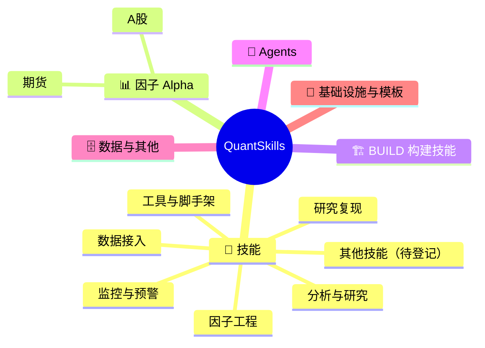

<!-- 本文件由 scripts/build.mjs 自动生成，请勿手工编辑。Generated file — do not edit by hand. -->
# 🧭 quantskills
> QuantSkills 组织全景导航 · 量化技能 / 因子 / Agent 一站式可点击索引，图文并茂。

**简体中文** | [English](README.en.md)

     

> **定位**：本仓是面向人类社区的「全景导航」，与组织另两套设施互补——[`registry`](https://github.com/quantskills/registry)（机器/AI 发现层）、组织主页 `.github`（门面）。

## 🗺️ 全景总览

## 📑 目录
- [⭐ 精选旗舰](#featured)
- [🧩 技能 Skills](#skills)
- [📊 因子 Alpha · A股](#alpha-ashare)
- [📊 因子 Alpha · 期货](#alpha-futures)
- [🏗️ BUILD 构建技能](#build)
- [🤖 Agents](#agents)
- [🗄️ 数据与其他](#others)
- [🧱 基础设施与模板](#infra)

## ⭐ 精选旗舰

### [skill-xingtai-catcher](https://github.com/quantskills/skill-xingtai-catcher)
> PatternCatcher MCP skill for similar K-line stock and futures search
 

### [build-b7-lhb-monitor](https://github.com/quantskills/build-b7-lhb-monitor)
> 龙虎榜监控+席位标签库 — panda-data BUILD 技能(B7)。收盘后抓取龙虎榜，席位标签匹配(北向/机构/游资/量化)，生成次日关注清单；个股详情页按上榜原因拆买卖营业部，支持区间统计与交互式HTML看板(搜索/筛选/排序/展开详情)。
 

### [build-b6-limitup-pool](https://github.com/quantskills/build-b6-limitup-pool)
> 涨停池动态管理 — panda-data BUILD 技能(B6)。每日维护涨停池，标记首板/连板数/炸板次数/回封时间，含题材分组/特殊形态/情绪面量化(分层晋级率·赚钱效应)，输出多维表格+HTML看板。
 

### [skill-a-share-stock-dossier](https://github.com/quantskills/skill-a-share-stock-dossier) 🟢可运行
> 输入一个 A 股代码，输出一份可溯源的中文个股尽调报告：基本面、分红资本运作、股东行为、质押解禁减持风险、资金面，一次查清。
 

平台: `claude-code` `codex` `hermes` `openclaw` `cursor`

### [skill-market-daily-review](https://github.com/quantskills/skill-market-daily-review) 🟢可运行
> 收盘后一句话生成 A 股当日复盘：指数与估值、市场宽度、行业概念热点、龙虎榜、大宗、两融、北向 —— 每个数字可溯源，支持定时自动生成。
 

平台: `claude-code` `codex` `hermes` `openclaw` `cursor`

### [alpha-a3-streak-leader-relay](https://github.com/quantskills/alpha-a3-streak-leader-relay)
> A 股「连板龙头接力」Alpha 因子（A3）。每日从 ≥3 板候选中识别 top-N 接力标的，T+1 open 进 / T+2 vwap 出。事件型设计，绝对评分，含因子检验 + 策略层回测 + HTML 可视化。
 

### [skill-factor-alpha191-alpha101](https://github.com/quantskills/skill-factor-alpha191-alpha101) ✅已验证
> 参考 JoinQuant 公式计算 Alpha101 和 Alpha191 因子值，支持全量和指定因子运行。
 

平台: `codex`

### [skill-pandadata-api](https://github.com/quantskills/skill-pandadata-api) 🟢可运行
> 把自然语言数据需求，精准路由到正确的 pandadata API，并生成可直接运行的 Python 调用。
 

平台: `claude-code` `codex` `openclaw` `cursor`

## 🧩 技能 Skills
可复用能力：因子计算、数据接入、研究复现、分析监控、选股复盘、交易执行等。

### 因子工程
| 项目 | 说明 | 状态 |
|---|---|---|
| [skill-factor-blend](https://github.com/quantskills/skill-factor-blend) | 多因子信号层合并：去冗余（相关矩阵 + Top-bucket overlap）→ 等权/ICIR/Score 三种加权方案 → 逐日截面 z-score 合成 → 重新评价复合因子。信号层操作（产出 composite_signal），非组合层资金分配。 | ⭐0 · Python · 🚀生产级 · 📅2026-06-24 |
| [skill-factor-decay](https://github.com/quantskills/skill-factor-decay) | 因子衰减分析：多期限 Rank IC 衰减曲线 → 指数/幂律/双指数拟合 → Bootstrap 半衰期置信区间 → 换手衰减 + Q5-Q1 分组收益衰减 → 推荐最优再平衡频率。已对接 Pandadata 计算 1d/3d/5d/10d/20d 五期限 forward returns。 | ⭐0 · Python · 🚀生产级 · 📅2026-06-24 |
| [skill-factor-orthogonalize](https://github.com/quantskills/skill-factor-orthogonalize) | 逐日截面 OLS 正交化：剥离行业(L1 one-hot) + 市值(log_dollar_vol) + 风格(beta/volatility) + 旧因子暴露，输出残差因子与暴露清零诊断报告。已对接 Pandadata 获取行业分类(sector_code_name)和风格控制变量。 | ⭐0 · Python · 🚀生产级 · 📅2026-06-24 |
| [skill-factor-alpha191-alpha101](https://github.com/quantskills/skill-factor-alpha191-alpha101) | 参考 JoinQuant 公式计算 Alpha101 和 Alpha191 因子值，支持全量和指定因子运行。 | ⭐1 · Python · ✅已验证 · 📅2026-06-24 |
| [skill-a1-lhb-tracking](https://github.com/quantskills/skill-a1-lhb-tracking) | 用 pandadata 龙虎榜数据追踪席位胜率、盈亏比和次日溢价，生成事件驱动排序因子。 | ⭐0 · Python · ✅已验证 · 📅2026-06-23 |
| [skill-doc-to-alphas](https://github.com/quantskills/skill-doc-to-alphas) | 从文档文本生成 OHLCV alpha 因子表达式，并提供公式契约与玩具数据自动验证。 | ⭐0 · Python · ⚪已登记 · 📅2026-06-22 |
| [skill-quant-factor-volume-stat-alpha](https://github.com/quantskills/skill-quant-factor-volume-stat-alpha) | 量能、量价和统计排序类因子库：216 个独立 OHLCV 因子 Skill，真实行情验证 216/216 全部通过。 | ⭐1 · Python · ✅已验证 · 📅2026-06-17 |
| [skill-quant-factor-risk-pattern-alpha](https://github.com/quantskills/skill-quant-factor-risk-pattern-alpha) | 风险状态与形态类因子库：288 个独立 OHLCV 因子 Skill，真实行情验证 288/288 全部通过。 | ⭐1 · Python · ✅已验证 · 📅2026-06-17 |
| [skill-quant-factor-directional-alpha](https://github.com/quantskills/skill-quant-factor-directional-alpha) | 方向类因子库：296 个独立 OHLCV 因子 Skill，真实行情验证 296/296 全部通过。 | ⭐0 · Python · ✅已验证 · 📅2026-06-17 |

### 工具与脚手架
| 项目 | 说明 | 状态 |
|---|---|---|
| [skill-factormad-debate-factor-mining](https://github.com/quantskills/skill-factormad-debate-factor-mining) | 使用 FactorMAD 风格的 LLM 多智能体辩论流程从 OHLCV 行情数据中挖掘代码型股票 Alpha 因子。 | ⭐0 · Python · 🟢可运行 · 📅2026-06-17 |
| [skill-x-trader-builder](https://github.com/quantskills/skill-x-trader-builder) | 把任意 X/Twitter 公开交易员的发帖历史，加工成 trader 专属的研究模型 Skill：init-run → 采集 → extract → auto-review → split → evaluate → template → report 九步流水线，从噪... | ⭐1 · Python · 🟢可运行 · 📅2026-06-17 |
| [skill-ssquant-trader-generator](https://github.com/quantskills/skill-ssquant-trader-generator) | 说一次想法，得到一个可以随时加载的 AI 交易员。 | ⭐0 · 🟢可运行 · 📅2026-06-17 |
| [skill-ssquant-ai-trader](https://github.com/quantskills/skill-ssquant-ai-trader) | 你负责说话，AI 负责写代码、跑策略、盯盘、控风险。 | ⭐0 · 🟢可运行 · 📅2026-06-17 |
| [skill-quant-factor-skill-factory](https://github.com/quantskills/skill-quant-factor-skill-factory) | 不是因子库本身，而是继续生产因子库的工具：批量生成、验证和打包框架中立的 OHLCV 量化因子 Skill。 | ⭐4 · Python · 🟢可运行 · 📅2026-06-17 |
| [skill-ic-analysis](https://github.com/quantskills/skill-ic-analysis) | 不是评分系统，而是IC 多维诊断 Skill：双 IC 对照 + IC 衰减曲线 + 子样本切片 + Top 篮 Jaccard + 时序累计图。回答"在哪类股票/什么周期上有效"。 | ⭐0 · ⚪已登记 · 📅2026-06-17 |
| [skill-factor-review](https://github.com/quantskills/skill-factor-review) | 不是单因子评价，而是因子库整体复盘 Skill：扫描实验日志 + 因子卡，输出三层报告（量化盘点 + 结构分析 + 研究建议），回答"已经做了什么、最优在哪、下一步该挖什么"。 | ⭐0 · ⚪已登记 · 📅2026-06-17 |
| [skill-factor-mine](https://github.com/quantskills/skill-factor-mine) | 不是因子库，而是因子挖掘的工作流 SOP：把"加一个新因子"这件事拆成可重复、可归因、可回滚的标准动作。 | ⭐0 · ⚪已登记 · 📅2026-06-17 |
| [skill-factor-evaluate](https://github.com/quantskills/skill-factor-evaluate) | 不是回测引擎，而是给单个因子打综合分的评价 Skill：双 IC + Sharpe + MDD + 单调性 + 换手 → 归一加权主分。 | ⭐0 · ⚪已登记 · 📅2026-06-17 |
| [skill-factor-debug](https://github.com/quantskills/skill-factor-debug) | 不是 IDE 调试器，而是因子崩溃 / 失效 / 数值异常的诊断手册：按"症状 → 候选病因 → 验证手段"组织的 9 类速查表，专治"因子跑挂"和"看似太好怀疑有 bug"。 | ⭐0 · ⚪已登记 · 📅2026-06-17 |
| [skill-backtest](https://github.com/quantskills/skill-backtest) | 不是回测框架，而是截面多头回测的标准协议：T+1 开盘成交、Top 等权、双边 15bp、涨跌停剔除、四联诊断图、5 项健康度自检。 | ⭐0 · ⚪已登记 · 📅2026-06-17 |
| [skill-time-series-analysis](https://github.com/quantskills/skill-time-series-analysis) | 结论先行的时序分析 Skill：原始序列、Log diff、分布、平稳性、协整和半衰期。 | ⭐0 · Python · 🟢可运行 · 📅2026-06-15 |

### 分析与研究
| 项目 | 说明 | 状态 |
|---|---|---|
| [skill-stock-screener](https://github.com/quantskills/skill-stock-screener) | 自然语言 A 股选股：把分红、估值、质押、北向、行业概念、财务增长、股东变化等条件转成可追溯 Pandadata 筛选。 | ⭐0 · 🟢可运行 · 📅2026-06-17 |
| [skill-serenity-research-model](https://github.com/quantskills/skill-serenity-research-model) | 从 Serenity（@aleabitoreddit）的公开 X 帖子里逆向研究逻辑：extract → clean → auto-review → evaluate → report 五段流水线，把帖子拆成最小信号单元，并用价格数据回看公开 call 的后续表现。 | ⭐8 · Python · ⚪已登记 · 📅2026-06-17 |
| [skill-options-vol-analyst](https://github.com/quantskills/skill-options-vol-analyst) | 期权波动率分析：期权链快照、隐含波动率、历史/实现波动率、IV 分位、期限结构、偏度与波动率溢价报告。 | ⭐1 · 🟢可运行 · 📅2026-06-17 |
| [skill-index-valuation-rotation](https://github.com/quantskills/skill-index-valuation-rotation) | 指数估值与行业轮动分析：PE/PB 分位、估值温度、宽基定投参考、行业动量排名与轮动摘要。 | ⭐1 · 🟢可运行 · 📅2026-06-17 |
| [skill-gaetano-crux-capital-research-model](https://github.com/quantskills/skill-gaetano-crux-capital-research-model) | 基于公开资料复刻 Gaetano / Crux Capital 的研究方法：把公开 X 帖子、公开 Substack 页面、财报与技术论文，拆解成「光子堆栈定位 → chokepoint 识别 → 证据分级 → 催化与风险跟踪」的结构化研究模型。 | ⭐1 · ⚪已登记 · 📅2026-06-17 |
| [skill-futures-deepview-analyst](https://github.com/quantskills/skill-futures-deepview-analyst) | 把"分析螺纹钢席位博弈""看豆粕期限结构和仓单"这类自然语言请求，转成 Pandadata 期货 DeepView 数据调用计划，输出事实与推断分离的中文研判报告。 | ⭐1 · 🟢可运行 · 📅2026-06-17 |
| [skill-a-share-stock-dossier](https://github.com/quantskills/skill-a-share-stock-dossier) | 输入一个 A 股代码，输出一份可溯源的中文个股尽调报告：基本面、分红资本运作、股东行为、质押解禁减持风险、资金面，一次查清。 | ⭐2 · 🟢可运行 · 📅2026-06-17 |

### 监控与预警
| 项目 | 说明 | 状态 |
|---|---|---|
| [skill-market-daily-review](https://github.com/quantskills/skill-market-daily-review) | 收盘后一句话生成 A 股当日复盘：指数与估值、市场宽度、行业概念热点、龙虎榜、大宗、两融、北向 —— 每个数字可溯源，支持定时自动生成。 | ⭐5 · Python · 🟢可运行 · 📅2026-06-17 |
| [skill-macro-monitor](https://github.com/quantskills/skill-macro-monitor) | 把"查 CPI""本周有什么经济数据""钢铁行业景气度怎么样"这类请求，路由到正确的 Pandadata getmacro 接口，输出带数据时效标注的中文宏观分析与定期监控。 | ⭐0 · 🟢可运行 · 📅2026-06-17 |
| [skill-event-risk-alert](https://github.com/quantskills/skill-event-risk-alert) | A 股持仓和自选股事件风险预警：解禁、质押、减持、ST、业绩预告、审计意见等事件扫描与可追溯告警报告。 | ⭐0 · Python · 🟢可运行 · 📅2026-06-17 |

### 数据接入
| 项目 | 说明 | 状态 |
|---|---|---|
| [skill-pandadata-warehouse](https://github.com/quantskills/skill-pandadata-warehouse) | Pandadata 本地数据仓库：用 DuckDB 与 Parquet 缓存、增量刷新、查询和校验行情数据，减少重复 API 调用。 | ⭐0 · 🟢可运行 · 📅2026-06-17 |
| [skill-pandadata-api](https://github.com/quantskills/skill-pandadata-api) | 把自然语言数据需求，精准路由到正确的 pandadata API，并生成可直接运行的 Python 调用。 | ⭐6 · Python · 🟢可运行 · 📅2026-06-17 |

### 研究复现
| 项目 | 说明 | 状态 |
|---|---|---|
| [skill-report-replication](https://github.com/quantskills/skill-report-replication) | 把一篇量化研报、论文、PDF、网页或文本材料，转化为 Pandadata 真实数据驱动的研究复现交付包：全文翻译 → 因子公式复现 → 有效性验证 → 策略代码 → 真实本地回测 → 交付摘要。 | ⭐0 · Python · 🟢可运行 · 📅2026-06-17 |
| [skill-paper-replication](https://github.com/quantskills/skill-paper-replication) | 把一篇量化金融论文（arXiv 或本地 PDF），变成一套可运行、可审计的复现实验：检索 → 提取 → 回测 → 图表 → 指标对照，全程框架无关。 | ⭐1 · Python · 🟢可运行 · 📅2026-06-17 |

### 其他技能（待登记）
| 项目 | 说明 | 状态 |
|---|---|---|
| [skill-trade-review](https://github.com/quantskills/skill-trade-review) | 一个交易复盘skill，股票期货皆可用。可根据市场走势、给定的策略方案以及交易记录，对逐笔交易和整体情况进行分析复盘，并给出下一阶段操作建议 | ⭐0 · Python · 📅2026-06-24 |
| [skill-f7-lei-cross-section-core-broker-follow](https://github.com/quantskills/skill-f7-lei-cross-section-core-broker-follow) | — | ⭐0 · Python · 📅2026-06-24 |
| [skill-investment-decision](https://github.com/quantskills/skill-investment-decision) | — | ⭐0 · Python · 📅2026-06-24 |
| [skill-xingtai-catcher](https://github.com/quantskills/skill-xingtai-catcher) | PatternCatcher MCP skill for similar K-line stock and futures search | ⭐5 · Python · 📅2026-06-22 |
| [skill-B12-intraday-position-manager](https://github.com/quantskills/skill-B12-intraday-position-manager) | 日内仓位动态管理 — panda-trading 量化交易工具 | ⭐0 · Python · 📅2026-06-20 |
| [skill-quant-research-replication](https://github.com/quantskills/skill-quant-research-replication) | Codex skill for quantitative research replication workflows. | ⭐0 · Python · 📅2026-06-17 |

## 📊 因子 Alpha · A股
A股选股/事件型 alpha 因子。

| 项目 | 说明 | 状态 |
|---|---|---|
| [alpha-a3-streak-leader-relay](https://github.com/quantskills/alpha-a3-streak-leader-relay) | A 股「连板龙头接力」Alpha 因子（A3）。每日从 ≥3 板候选中识别 top-N 接力标的，T+1 open 进 / T+2 vwap 出。事件型设计，绝对评分，含因子检验 + 策略层回测 + HTML 可视化。 | ⭐0 · Python · 📅2026-06-24 |
| [alpha-a04-sector-fund-flow](https://github.com/quantskills/alpha-a04-sector-fund-flow) | — | ⭐0 · Python · 📅2026-06-21 |
| [alpha-a2-first-limit-up-with-low-open](https://github.com/quantskills/alpha-a2-first-limit-up-with-low-open) | 首板涨停低开 | ⭐0 · Python · 📅2026-06-21 |
| [alpha-A06-hotmoney-reversal](https://github.com/quantskills/alpha-A06-hotmoney-reversal) | The SKILLS supports IC/IR calculation, stratified backtesting, monotonicity testing, turnover rate analysis and decay curve plotting for quantitative factor research. | ⭐0 · Python · 📅2026-06-18 |

## 📊 因子 Alpha · 期货
期货截面/持仓博弈类 alpha 因子。

| 项目 | 说明 | 状态 |
|---|---|---|
| [alpha-f11-seat-ensemble](https://github.com/quantskills/alpha-f11-seat-ensemble) | 席位集中度+增量动态ensemble alpha因子 | V3反转×INC动量，集中度驱动动态加权 | ⭐0 · Python · 📅2026-06-22 |
| [alpha-f4-oipd](https://github.com/quantskills/alpha-f4-oipd) | OI价格背离因子V4.6(OIPD) | 4路信号ensemble+OI加速度+波动率门控+截面增强 | ⭐0 · Python · 📅2026-06-22 |
| [alpha-f001-seat-long-short-disagreement](https://github.com/quantskills/alpha-f001-seat-long-short-disagreement) | 期货截面因子：席位多空分歧，多头增仓-空头增仓差值，力量对比 | ⭐0 · Python · 📅2026-06-21 |
| [alpha-f5-member-position-concentration](https://github.com/quantskills/alpha-f5-member-position-concentration) | alpha-f5-member-position-concentration | ⭐0 · Python · 📅2026-06-21 |
| [alpha-f6-family-position-reverse](https://github.com/quantskills/alpha-f6-family-position-reverse) | alpha-f6-family-position-reverse | ⭐0 · Python · 📅2026-06-21 |
| [alpha-f8-family-main-divergence](https://github.com/quantskills/alpha-f8-family-main-divergence) | alpha-f8-family-main-divergence | ⭐0 · Python · 📅2026-06-21 |
| [alpha-f1-position-change](https://github.com/quantskills/alpha-f1-position-change) | — | ⭐0 · Python · 📅2026-06-18 |

## 🏗️ BUILD 构建技能
基于 panda-data / panda-trading 的构建型技能（看板、池子、风控）。

| 项目 | 说明 | 状态 |
|---|---|---|
| [build-b7-lhb-monitor](https://github.com/quantskills/build-b7-lhb-monitor) | 龙虎榜监控+席位标签库 — panda-data BUILD 技能(B7)。收盘后抓取龙虎榜，席位标签匹配(北向/机构/游资/量化)，生成次日关注清单；个股详情页按上榜原因拆买卖营业部，支持区间统计与交互式HTML看板(搜索/筛选/排序/展开详情)。 | ⭐0 · HTML · 📅2026-06-24 |
| [build-b6-limitup-pool](https://github.com/quantskills/build-b6-limitup-pool) | 涨停池动态管理 — panda-data BUILD 技能(B6)。每日维护涨停池，标记首板/连板数/炸板次数/回封时间，含题材分组/特殊形态/情绪面量化(分层晋级率·赚钱效应)，输出多维表格+HTML看板。 | ⭐0 · Python · 📅2026-06-24 |
| [build-b11-auto-stop-loss-take-profit](https://github.com/quantskills/build-b11-auto-stop-loss-take-profit) | 按入场日期和开盘价自动判断止盈、止损、强平，以及单票仓位上限控制。 | ⭐0 · Python · 📅2026-06-21 |
| [build-b12-intraday-position-manager](https://github.com/quantskills/build-b12-intraday-position-manager) | 日内仓位动态管理 — panda-trading BUILD 技能 | ⭐0 · Python · 📅2026-06-21 |
| [build-B10-factor-evaluation](https://github.com/quantskills/build-B10-factor-evaluation) | The system supports IC/IR calculation, stratified backtesting, monotonicity testing, turnover rate analysis and decay curve plotting for quantitative factor research. | ⭐0 · HTML · 📅2026-06-18 |

## 🤖 Agents
多 Agent 协作工作流：研究自动化、风险监控、内容生成等。

| 项目 | 说明 | 状态 |
|---|---|---|
| [agent-for-liangshuyuan-tasks](https://github.com/quantskills/agent-for-liangshuyuan-tasks) | 基于 Claude Code 多 Agent 协作框架的量化交易工具库，为完成量枢院任务而创建 | ⭐0 · Python · 📅2026-06-21 |
| [agent-quantspace](https://github.com/quantskills/agent-quantspace) | 面向 AI 编码代理的量化研究框架，组织数据、技能、策略、回测和报告工作流。 | ⭐14 · Python · 🟢可运行 · 📅2026-06-17 |
| [agent-market-regime-monitor](https://github.com/quantskills/agent-market-regime-monitor) | 用 Pandadata 行情、指数、宽度、波动和资金证据判断市场处于趋势、震荡、退潮或风险扩张状态。 | ⭐0 · Python · ✅已验证 · 📅2026-06-17 |
| [agent-derivatives-skew-sentiment-monitor](https://github.com/quantskills/agent-derivatives-skew-sentiment-monitor) | 用期权隐含波动率和标的历史波动率观察衍生品市场风险偏好，不重复已有期权波动率分析 Skill。 | ⭐0 · Python · ✅已验证 · 📅2026-06-17 |
| [agent-crowding-risk-monitor](https://github.com/quantskills/agent-crowding-risk-monitor) | 用价格、成交、融资、龙虎榜热度识别抱团、过热、踩踏和去杠杆风险。 | ⭐0 · Python · ✅已验证 · 📅2026-06-17 |
| [agent-correlation-break-research](https://github.com/quantskills/agent-correlation-break-research) | 用多股票与指数收益相关性变化识别风格切换、组合分散失效和结构性行情变化。 | ⭐0 · Python · ✅已验证 · 📅2026-06-17 |

## 🗄️ 数据与其他
数据工具、抓取、预测市场等。

| 项目 | 说明 | 状态 |
|---|---|---|
| [news-sentiment-analyst](https://github.com/quantskills/news-sentiment-analyst) | A-share financial news sentiment analyst - Claude Code Skill | ⭐0 · Python · 📅2026-06-25 |

## 🧱 基础设施与模板
治理与脚手架，不属于内容资产。

| 项目 | 说明 | 状态 |
|---|---|---|
| [registry](https://github.com/quantskills/registry) | Public display registry for QUANTSKILLS skill-* and agent-* assets. | ⭐0 · Python · 📅2026-06-24 |
| [.github](https://github.com/quantskills/.github) | — | ⭐0 · 📅2026-06-24 |
| [skill-template](https://github.com/quantskills/skill-template) | Template repository for QUANTSKILLS skill-* projects. | ⭐1 · 📅2026-06-17 |
| [join](https://github.com/quantskills/join) | — | ⭐0 · 📅2026-06-17 |
| [agent-template](https://github.com/quantskills/agent-template) | Template repository for QUANTSKILLS agent-* projects. | ⭐0 · 📅2026-06-17 |

---
_本文件由 [`scripts/build.mjs`](scripts/build.mjs) 每日自动生成（2026-06-25）。_
