# 🧭 QuantSkills

**简体中文** | [English](README.en.md) · [浏览网站](https://www.quantskills.ai/)

> 可发现、可安装、可验证、可分享的量化 Skill 与 Agent 社区目录。

QuantSkills 是由 [PandaAI](https://www.pandaaiquant.com/) 发起的开放量化社区项目；它不是 PandaAI 的官方认证或投资建议。这里汇集可复用的研究、数据、验证和自动化能力，让人和 AI Agent 都能更清晰地发现、安装、审阅与组合它们。

## 社区愿景

我们相信量化经验应当能被清楚描述、复现和讨论：贡献者提供可检查的能力包与边界，使用者依据说明、数据来源和风险限制自行验证。目录快照只陈列公开元数据，不代表质量背书、收益承诺或生产可用性保证。

## 加入与贡献

- 阅读 [社区规则](https://github.com/quantskills/join/blob/main/COMMUNITY_RULES.md)，从 [join](https://github.com/quantskills/join) 开始加入讨论。
- 用 [skill-template](https://github.com/quantskills/skill-template) 创建 Skill，或用 [agent-template](https://github.com/quantskills/agent-template) 创建 Agent；提交前说明数据、假设、参数、限制和风险边界。
- 在 [registry](https://github.com/quantskills/registry) 提交可展示的元数据，并通过仓库 issue / PR 分享改进。

## 关键入口

[全部组织仓库](https://github.com/orgs/quantskills/repositories) · [导航仓库](https://github.com/quantskills/quantskills) · [注册表](https://github.com/quantskills/registry) · [模板](https://github.com/quantskills/skill-template) · [加入社区](https://github.com/quantskills/join)

## 动态目录

以下内容由固定快照生成；网站入口见 [www.quantskills.ai](https://www.quantskills.ai/)。

<!-- CATALOG:START -->
<!-- catalog-snapshot: sha256:ecb9a3d03c6df06f3d5ca7961766ad2927ab3d370ee64e80343c0dd6946567a7 -->
> 快照 sha256:ecb9a3d03c6df06f3d5ca7961766ad2927ab3d370ee64e80343c0dd6946567a7。**158** 项公开资产，覆盖 **10** 个分类；**1 个已发布**结构化端点，**157 个待维护者接口审核**。

## 分类总览
- [01 数据接口与数据仓库](#cat-01) — 7 项资产（数据源与连接器 / 仓库与缓存 / 行情数据治理 / PIT 与数据质量）
- [02 因子研发工具箱](#cat-02) — 32 项资产（因子创意 / 因子生成 / 正交与合成 / 因子筛选 / 因子评价 / 因子池与在线化）
- [03 市场与标的分析](#cat-03) — 32 项资产（A 股 / 港股与美股 / ETF、基金与指数 / 期货与商品 / 期权与可转债 / 宏观与跨资产）
- [04 风险监控与预警](#cat-04) — 19 项资产（市场状态 / 资金与拥挤 / 流动性风险 / 公司事件 / 监管合规 / 组合压力测试 / 自动预警）
- [05 策略回测与交易工具](#cat-05) — 19 项资产（策略与信号 / 组合构建 / 回测引擎 / 绩效归因 / 交易成本 / 微观结构 / 仓位与订单 / 模拟与实盘执行）
- [06 投研模型与研究复现](#cat-06) — 18 项资产（论文复现 / 策略复现 / 统计与机器学习模型 / 投资者研究模型 / 实验登记与可重复研究）
- [07 研究验证与质量工具](#cat-07) — 11 项资产（前视与数据泄漏 / 幸存者偏差 / Walk-forward 与 OOS / 信号稳定性 / 预测校准 / 数值与模型审计 / 工作流审计）
- [08 资讯搜索与知识分析](#cat-08) — 6 项资产（新闻与公告 / 机构研究 / 每日复盘）
- [09 量化智能体与自动化](#cat-09) — 8 项资产（研究 Agent / 监控与风险 Agent / 交易执行 Agent / 工作流编排 Agent）
- [10 基础设施与模板](#cat-10) — 6 项资产（Skill 模板 / Agent 模板 / 构建与发布工具）

## 工作流地图
- **数据基础 / Data foundation** (2 个阶段): data-ingestion, data-quality
- **研究信号 / Research signal** (4 个阶段): feature-engineering, factor-generation, factor-screening, modeling
- **组合验证 / Portfolio validation** (4 个阶段): portfolio-construction, backtesting, evaluation, risk
- **监控交易 / Monitoring & trading** (3 个阶段): monitoring, execution, reporting
- **编排 / Orchestration** (1 个阶段): orchestration

<strong>01 数据接口与数据仓库</strong> — 7 项资产，含截图 1

### 数据源与连接器（2）

| 项目 | 双语摘要 | 主阶段 | 输入 | 输出 | 接口状态 | 截图 |
|---|---|---|---|---|---|---|
| [skill-pandadata-api](https://github.com/quantskills/skill-pandadata-api) | 为多种智能体运行时提供Pandadata市场和研究数据API调用与契约查询。 | data-ingestion | — | — | 待维护者审核 / 无公开端点 |  |
| [skill-us-sec-edgar-harvester](https://github.com/quantskills/skill-us-sec-edgar-harvester) | 采集并结构化美国 SEC EDGAR 公开申报文件。 | data-ingestion | — | — | 待维护者审核 / 无公开端点 |  |

### 仓库与缓存（1）

| 项目 | 双语摘要 | 主阶段 | 输入 | 输出 | 接口状态 | 截图 |
|---|---|---|---|---|---|---|
| [skill-pandadata-warehouse](https://github.com/quantskills/skill-pandadata-warehouse) | 管理本地Pandadata DuckDB和Parquet量化数据仓库、缓存和查询流程。 | data-ingestion | — | market-bar | 已发布 | <a href="https://raw.githubusercontent.com/quantskills/quantskills/main/assets/skill-pandadata-warehouse.png">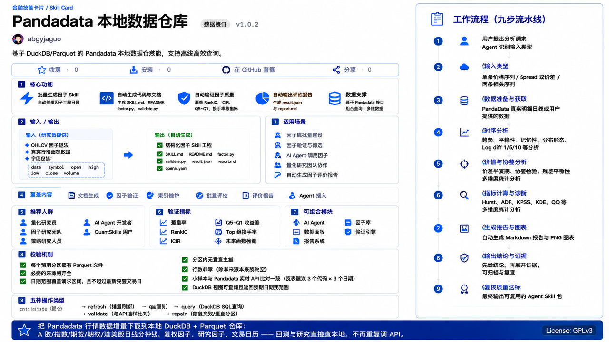</a> |

### 行情数据治理（3）

| 项目 | 双语摘要 | 主阶段 | 输入 | 输出 | 接口状态 | 截图 |
|---|---|---|---|---|---|---|
| [skill-corporate-action-adjustment-auditor](https://github.com/quantskills/skill-corporate-action-adjustment-auditor) | 在研究或回测前审计原始与复权价格中的拆分和现金分红一致性。 | data-quality | — | — | 待维护者审核 / 无公开端点 |  |
| [skill-futures-roll-auditor](https://github.com/quantskills/skill-futures-roll-auditor) | 审计连续合约选择、换月价差和调整因子，并生成换月账本。 | data-quality | — | — | 待维护者审核 / 无公开端点 |  |
| [skill-intraday-data-quality-auditor](https://github.com/quantskills/skill-intraday-data-quality-auditor) | 审计标准化日内OHLCV数据的时间戳、缺口、价格、成交量和交易日缺陷。 | data-quality | — | — | 待维护者审核 / 无公开端点 |  |

### PIT 与数据质量（1）

| 项目 | 双语摘要 | 主阶段 | 输入 | 输出 | 接口状态 | 截图 |
|---|---|---|---|---|---|---|
| [skill-a-share-pit-fundamental-vintage-builder](https://github.com/quantskills/skill-a-share-pit-fundamental-vintage-builder) | 按披露可见时点构建并审计 A 股财务数据，避免使用后续重述信息。 | data-quality | — | — | 待维护者审核 / 无公开端点 |  |

<strong>02 因子研发工具箱</strong> — 32 项资产，含截图 9

### 因子创意（2）

| 项目 | 双语摘要 | 主阶段 | 输入 | 输出 | 接口状态 | 截图 |
|---|---|---|---|---|---|---|
| [skill-factor-idea-generation](https://github.com/quantskills/skill-factor-idea-generation) | 根据默认数据范围生成包含经济逻辑和风险说明的因子候选想法。 | factor-generation | — | — | 待维护者审核 / 无公开端点 |  |
| [skill-factormad-debate-factor-mining](https://github.com/quantskills/skill-factormad-debate-factor-mining) | 参考FactorMAD多智能体辩论框架进行可解释的股票Alpha因子挖掘。 | factor-generation | — | — | 待维护者审核 / 无公开端点 | <a href="https://raw.githubusercontent.com/quantskills/quantskills/main/assets/skill-factormad-debate-factor-mining.png">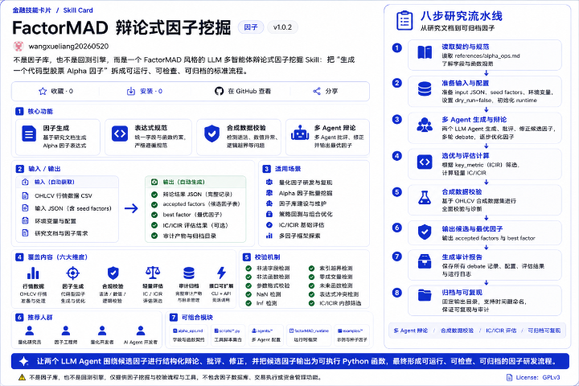</a> |

### 因子生成（17）

| 项目 | 双语摘要 | 主阶段 | 输入 | 输出 | 接口状态 | 截图 |
|---|---|---|---|---|---|---|
| [skill-a1-lhb-tracking](https://github.com/quantskills/skill-a1-lhb-tracking) | 用龙虎榜席位历史表现和次日溢价生成事件驱动排序因子。 | factor-generation | — | — | 待维护者审核 / 无公开端点 |  |
| [skill-alpha-a06-hotmoney-reversal](https://github.com/quantskills/skill-alpha-a06-hotmoney-reversal) | 从龙虎榜席位与行情数据计算热钱席位冷却反转因子并提供验证与回测产物。 | factor-generation | — | — | 待维护者审核 / 无公开端点 |  |
| [skill-alpha-f1-position-change](https://github.com/quantskills/skill-alpha-f1-position-change) | 从期货前 20 席位净持仓变化计算持仓突变因子并生成信号。 | factor-generation | — | — | 待维护者审核 / 无公开端点 |  |
| [skill-alpha-f5-member-position-concentration](https://github.com/quantskills/skill-alpha-f5-member-position-concentration) | 从机构、游资与北向等席位净持仓计算成员持仓集中度信号。 | factor-generation | — | — | 待维护者审核 / 无公开端点 |  |
| [skill-alpha-f6-family-position-reverse](https://github.com/quantskills/skill-alpha-f6-family-position-reverse) | 从期货家族席位持仓反转关系计算交易信号。 | factor-generation | — | — | 待维护者审核 / 无公开端点 |  |
| [skill-alpha-f8-family-main-divergence](https://github.com/quantskills/skill-alpha-f8-family-main-divergence) | 从期货家族席位与主力席位持仓背离计算因子信号。 | factor-generation | — | — | 待维护者审核 / 无公开端点 |  |
| [skill-alpha-ncav-graham](https://github.com/quantskills/skill-alpha-ncav-graham) | 计算 Graham NCAV 净流动资产折价因子，面向排除金融股的 A 股深度价值筛选并生成信号。 | factor-generation | — | — | 待维护者审核 / 无公开端点 |  |
| [skill-doc-to-alphas](https://github.com/quantskills/skill-doc-to-alphas) | 定义OHLCV因子表达式格式和校验规则，用于从文档生成Alpha因子。 | factor-generation | — | — | 待维护者审核 / 无公开端点 | <a href="https://raw.githubusercontent.com/quantskills/quantskills/main/assets/skill-doc-to-alphas.png">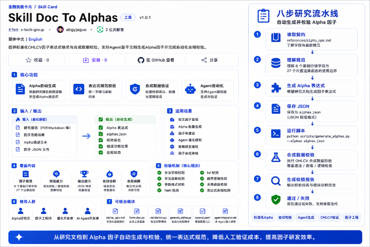</a> |
| [skill-factor-alpha191-alpha101](https://github.com/quantskills/skill-factor-alpha191-alpha101) | 从长表OHLCV CSV批量计算Alpha101和Alpha191因子并输出宽表CSV。 | factor-generation | — | — | 待维护者审核 / 无公开端点 |  |
| [skill-factor-mine](https://github.com/quantskills/skill-factor-mine) | 提供从假设、实验记录到评分和接受或回滚的因子挖掘SOP。 | factor-generation | — | — | 待维护者审核 / 无公开端点 | <a href="https://raw.githubusercontent.com/quantskills/quantskills/main/assets/skill-factor-mine.png">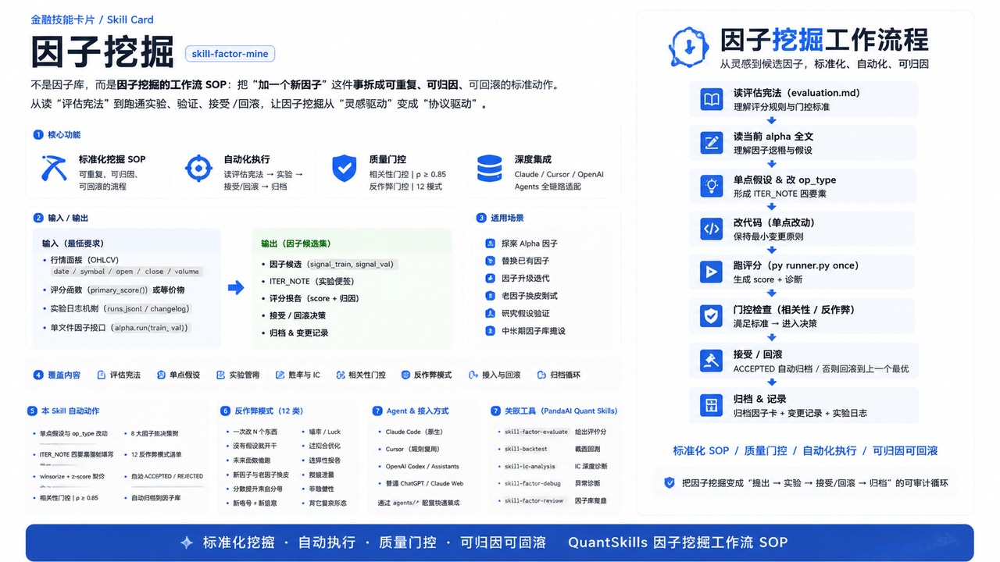</a> |
| [skill-factor-mining-pandaai](https://github.com/quantskills/skill-factor-mining-pandaai) | 使用PandaAI数据和分析反馈进行因子挖掘，或从公开文档提取因子。 | factor-generation | — | — | 待维护者审核 / 无公开端点 |  |
| [skill-factor-optimize](https://github.com/quantskills/skill-factor-optimize) | 对已有股票或期货因子执行参数扫描、消融和版本增强。 | factor-generation | — | — | 待维护者审核 / 无公开端点 |  |
| [skill-fundamental-factor-analysis](https://github.com/quantskills/skill-fundamental-factor-analysis) | 从季度财报计算并验证A股估值、质量和成长因子。 | factor-generation | — | — | 待维护者审核 / 无公开端点 |  |
| [skill-overseas-equity-factor-miner](https://github.com/quantskills/skill-overseas-equity-factor-miner) | 发现并以IC、衰减和换手率验证港美股横截面alpha因子。 | factor-generation | — | — | 待维护者审核 / 无公开端点 |  |
| [skill-quant-factor-directional-alpha](https://github.com/quantskills/skill-quant-factor-directional-alpha) | 提供用于趋势、突破和反转研究的 OHLCV 方向因子库。 | factor-generation | — | — | 待维护者审核 / 无公开端点 | <a href="https://raw.githubusercontent.com/quantskills/quantskills/main/assets/skill-quant-factor-directional-alpha.png">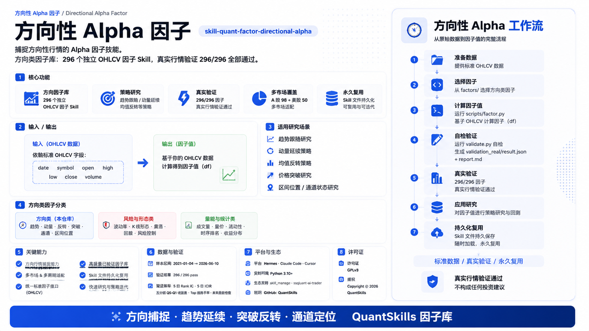</a> |
| [skill-quant-factor-risk-pattern-alpha](https://github.com/quantskills/skill-quant-factor-risk-pattern-alpha) | 提供用于波动、K 线形态和回撤压力研究的 OHLCV 因子库。 | factor-generation | — | — | 待维护者审核 / 无公开端点 | <a href="https://raw.githubusercontent.com/quantskills/quantskills/main/assets/skill-quant-factor-risk-pattern-alpha.png">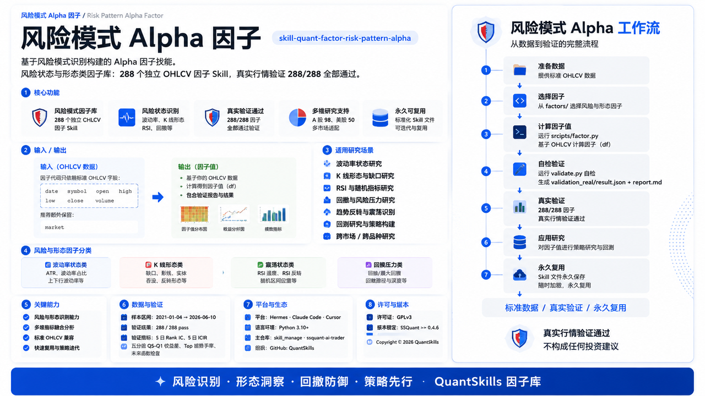</a> |
| [skill-quant-factor-volume-stat-alpha](https://github.com/quantskills/skill-quant-factor-volume-stat-alpha) | 提供用于成交量和量价统计研究的 OHLCV 因子库。 | factor-generation | — | — | 待维护者审核 / 无公开端点 | <a href="https://raw.githubusercontent.com/quantskills/quantskills/main/assets/skill-quant-factor-volume-stat-alpha.png">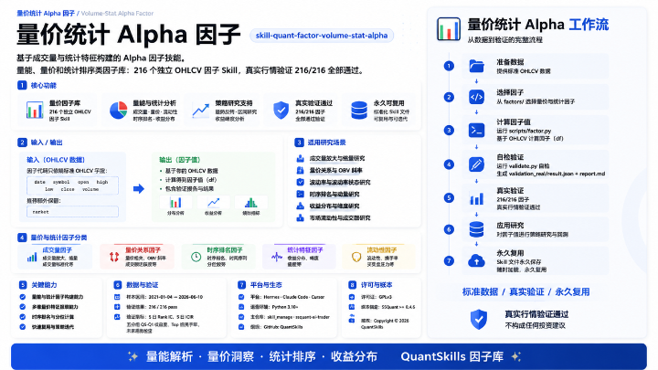</a> |

### 正交与合成（3）

| 项目 | 双语摘要 | 主阶段 | 输入 | 输出 | 接口状态 | 截图 |
|---|---|---|---|---|---|---|
| [skill-factor-blend](https://github.com/quantskills/skill-factor-blend) | 将多个因子信号去冗余、加权并合成为复合信号。 | factor-generation | — | — | 待维护者审核 / 无公开端点 |  |
| [skill-factor-orthogonalize](https://github.com/quantskills/skill-factor-orthogonalize) | 对截面因子进行逐日OLS正交化，并输出残差因子和暴露诊断。 | factor-generation | — | — | 待维护者审核 / 无公开端点 |  |
| [skill-ml-factor-ensemble](https://github.com/quantskills/skill-ml-factor-ensemble) | 用防泄漏滚动验证将机器学习模型集成为因子元信号。 | modeling | — | — | 待维护者审核 / 无公开端点 |  |

### 因子筛选（3）

| 项目 | 双语摘要 | 主阶段 | 输入 | 输出 | 接口状态 | 截图 |
|---|---|---|---|---|---|---|
| [skill-factor-grouped-wrapper](https://github.com/quantskills/skill-factor-grouped-wrapper) | 按分组封装因子处理流程和工作流图。 | factor-screening | — | — | 待维护者审核 / 无公开端点 |  |
| [skill-factor-ranking-sage](https://github.com/quantskills/skill-factor-ranking-sage) | 在本地因子和标签数据上运行mRMR或Marginal-SAGE并输出Top-K排名。 | factor-screening | — | — | 待维护者审核 / 无公开端点 |  |
| [skill-residual-guided-factor-selection](https://github.com/quantskills/skill-residual-guided-factor-selection) | 使用残差 IC 和样本外评估筛选因子组合。 | factor-screening | — | — | 待维护者审核 / 无公开端点 |  |

### 因子评价（5）

| 项目 | 双语摘要 | 主阶段 | 输入 | 输出 | 接口状态 | 截图 |
|---|---|---|---|---|---|---|
| [skill-build-b10-factor-evaluation](https://github.com/quantskills/skill-build-b10-factor-evaluation) | 评估因子的 IC、IR、分层回测、单调性、换手率和衰减表现。 | evaluation | — | — | 待维护者审核 / 无公开端点 |  |
| [skill-factor-evaluate](https://github.com/quantskills/skill-factor-evaluate) | 对单个截面因子计算IC、夏普、回撤、单调性和换手的综合评分。 | evaluation | — | — | 待维护者审核 / 无公开端点 | <a href="https://raw.githubusercontent.com/quantskills/quantskills/main/assets/skill-factor-evaluate.png">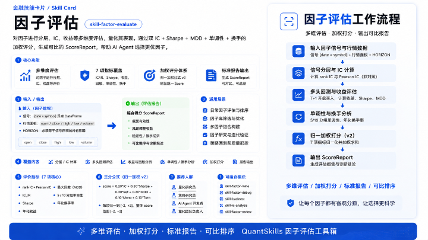</a> |
| [skill-factor-mason](https://github.com/quantskills/skill-factor-mason) | 检查单因子研究中的时点、IC/IR、成本和中性化质量。 | evaluation | — | — | 待维护者审核 / 无公开端点 |  |
| [skill-factor-review](https://github.com/quantskills/skill-factor-review) | 扫描因子库和实验日志，生成量化盘点、结构分析和研究建议。 | evaluation | — | — | 待维护者审核 / 无公开端点 | <a href="https://raw.githubusercontent.com/quantskills/quantskills/main/assets/skill-factor-review.png">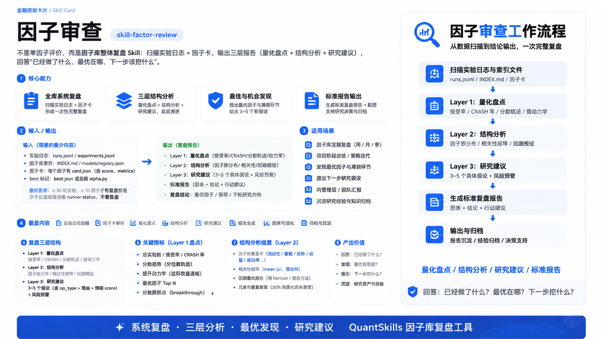</a> |
| [skill-ic-analysis](https://github.com/quantskills/skill-ic-analysis) | 评估量化因子的IC、分组表现和预测有效性。 | evaluation | — | — | 待维护者审核 / 无公开端点 | <a href="https://raw.githubusercontent.com/quantskills/quantskills/main/assets/skill-ic-analysis.png">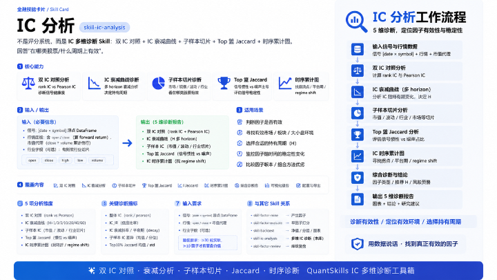</a> |

### 因子池与在线化（2）

| 项目 | 双语摘要 | 主阶段 | 输入 | 输出 | 接口状态 | 截图 |
|---|---|---|---|---|---|---|
| [skill-factor-pool-evolution](https://github.com/quantskills/skill-factor-pool-evolution) | 根据种子因子池的评估生成变异、交叉和推荐。 | factor-screening | — | — | 待维护者审核 / 无公开端点 |  |
| [skill-pandaai-factor-online](https://github.com/quantskills/skill-pandaai-factor-online) | 支持PandaAI因子大赛环境配置、在线挖掘、批量回测和成本复盘。 | factor-generation | — | — | 待维护者审核 / 无公开端点 |  |

<strong>03 市场与标的分析</strong> — 32 项资产，含截图 4

### A 股（7）

| 项目 | 双语摘要 | 主阶段 | 输入 | 输出 | 接口状态 | 截图 |
|---|---|---|---|---|---|---|
| [skill-a-share-stock-dossier](https://github.com/quantskills/skill-a-share-stock-dossier) | 输入一个 A 股代码，汇总基本面、公司行动、股东行为、事件风险与资金面的可溯源尽调报告。 | reporting | — | — | 待维护者审核 / 无公开端点 | <a href="https://raw.githubusercontent.com/quantskills/quantskills/main/assets/skill-a-share-stock-dossier.png">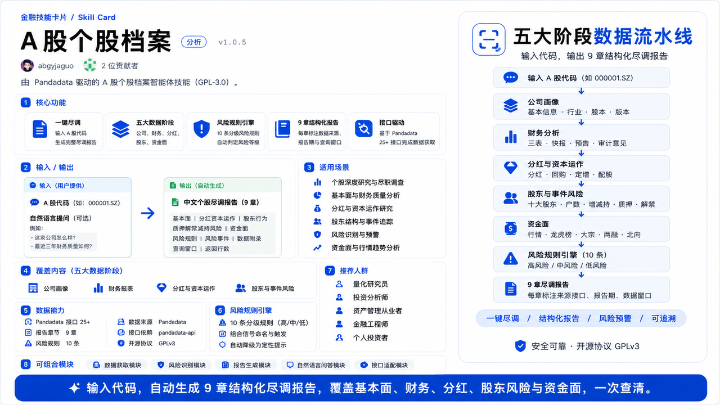</a> |
| [skill-buffett-moat-screener](https://github.com/quantskills/skill-buffett-moat-screener) | 按巴菲特式护城河、估值和点时数据筛选 A 股与美股公司并生成研究记录。 | modeling | — | — | 待维护者审核 / 无公开端点 |  |
| [skill-concept-rotation-monitor](https://github.com/quantskills/skill-concept-rotation-monitor) | 监测 A 股概念与题材的动量、宽度和轮动变化并生成研究报告。 | monitoring | — | — | 待维护者审核 / 无公开端点 |  |
| [skill-dividend-yield-scan](https://github.com/quantskills/skill-dividend-yield-scan) | 计算A股滚动股息率、连续分红和除权除息日历。 | reporting | — | — | 待维护者审核 / 无公开端点 |  |
| [skill-holder-structure-scan](https://github.com/quantskills/skill-holder-structure-scan) | 跟踪A股股东户数、前十大持股和自由流通股以评估筹码集中度。 | monitoring | — | — | 待维护者审核 / 无公开端点 |  |
| [skill-post-market-screener](https://github.com/quantskills/skill-post-market-screener) | 收盘后结合技术形态和资金流筛选 A 股股票并生成报告。 | factor-screening | — | — | 待维护者审核 / 无公开端点 |  |
| [skill-stock-screener](https://github.com/quantskills/skill-stock-screener) | 依据自然语言筛选条件和 Pandadata 证据筛选 A 股股票。 | factor-screening | — | — | 待维护者审核 / 无公开端点 | <a href="https://raw.githubusercontent.com/quantskills/quantskills/main/assets/skill-stock-screener.png">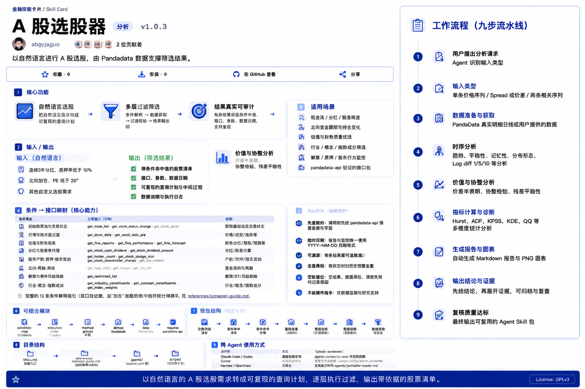</a> |

### 港股与美股（9）

| 项目 | 双语摘要 | 主阶段 | 输入 | 输出 | 接口状态 | 截图 |
|---|---|---|---|---|---|---|
| [skill-cross-listing-parity](https://github.com/quantskills/skill-cross-listing-parity) | 比较 A/H 与中国 ADR 的跨市场价格平价、汇率和换股比例并输出监测报告。 | monitoring | — | — | 待维护者审核 / 无公开端点 |  |
| [skill-hk-stock-dossier](https://github.com/quantskills/skill-hk-stock-dossier) | 基于Pandadata接口生成覆盖九个维度的港股尽职调查研报。 | reporting | — | — | 待维护者审核 / 无公开端点 |  |
| [skill-hk-us-consensus-radar](https://github.com/quantskills/skill-hk-us-consensus-radar) | 汇总港美股卖方评级、目标价和成长预期及其变化。 | reporting | — | — | 待维护者审核 / 无公开端点 |  |
| [skill-hk-us-consensus-revision-radar](https://github.com/quantskills/skill-hk-us-consensus-revision-radar) | 组织港美股目标价和评级的跨期修订轨迹，并生成研究报告。 | monitoring | — | — | 待维护者审核 / 无公开端点 |  |
| [skill-hk-us-dividend-events](https://github.com/quantskills/skill-hk-us-dividend-events) | 基于Pandadata外盘接口生成港股和美股分红事件报告。 | reporting | — | — | 待维护者审核 / 无公开端点 |  |
| [skill-hk-us-insider-radar](https://github.com/quantskills/skill-hk-us-insider-radar) | 扫描港股和美股内部人交易、净买卖方向、聚集交易及持股变化。 | monitoring | — | — | 待维护者审核 / 无公开端点 |  |
| [skill-hk-us-quote-scan](https://github.com/quantskills/skill-hk-us-quote-scan) | 生成港美股行情、流动性、估值和行业相对位置的研究快照。 | reporting | — | — | 待维护者审核 / 无公开端点 |  |
| [skill-stock-memory-analyzer-usa](https://github.com/quantskills/skill-stock-memory-analyzer-usa) | 对美国存储芯片股票开展多维度研究分析。 | reporting | — | — | 待维护者审核 / 无公开端点 |  |
| [skill-us-sector-rotation](https://github.com/quantskills/skill-us-sector-rotation) | 生成美国行业表现、估值和轮动的事实性报告。 | reporting | — | — | 待维护者审核 / 无公开端点 |  |

### ETF、基金与指数（4）

| 项目 | 双语摘要 | 主阶段 | 输入 | 输出 | 接口状态 | 截图 |
|---|---|---|---|---|---|---|
| [skill-etf-arbitrage-monitor](https://github.com/quantskills/skill-etf-arbitrage-monitor) | 监控A股ETF一级和二级市场折溢价及申赎篮子可行性。 | monitoring | — | — | 待维护者审核 / 无公开端点 |  |
| [skill-etf-fund-evaluator](https://github.com/quantskills/skill-etf-fund-evaluator) | 评价境内非QDII被动股票指数ETF，并支持同指数横向比较。 | evaluation | — | — | 待维护者审核 / 无公开端点 |  |
| [skill-index-rebalance-event-study](https://github.com/quantskills/skill-index-rebalance-event-study) | 围绕指数纳入、剔除和权重调整公告或生效日运行可复现事件研究。 | evaluation | — | — | 待维护者审核 / 无公开端点 |  |
| [skill-index-valuation-rotation](https://github.com/quantskills/skill-index-valuation-rotation) | 分析A股指数估值分位、行业相对估值和轮动线索。 | reporting | — | — | 待维护者审核 / 无公开端点 | <a href="https://raw.githubusercontent.com/quantskills/quantskills/main/assets/skill-index-valuation-rotation.png">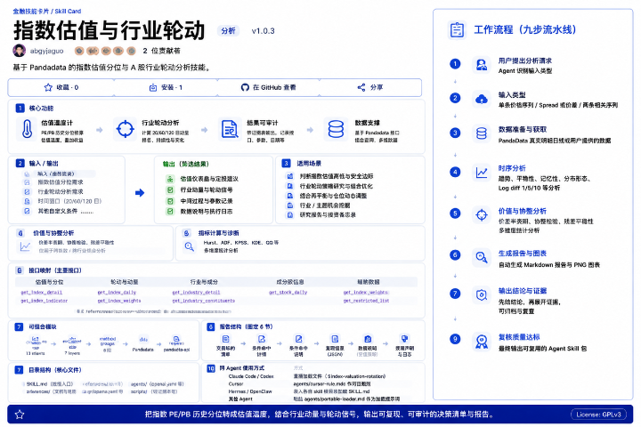</a> |

### 期货与商品（6）

| 项目 | 双语摘要 | 主阶段 | 输入 | 输出 | 接口状态 | 截图 |
|---|---|---|---|---|---|---|
| [skill-ag-futures-seasonality](https://github.com/quantskills/skill-ag-futures-seasonality) | 从农产品期货日线计算各月份历史季节性并叠加作物日历生成可视化报告。 | modeling | — | — | 待维护者审核 / 无公开端点 |  |
| [skill-commodity-carry-cta](https://github.com/quantskills/skill-commodity-carry-cta) | 构建商品期货 carry、时序动量、横截面动量、基差动量和库存因子并回测轮动。 | factor-generation | — | — | 待维护者审核 / 无公开端点 |  |
| [skill-futures-deepview-analyst](https://github.com/quantskills/skill-futures-deepview-analyst) | 将期货DeepView自然语言请求转为数据调用计划和事实与推断分离的报告。 | reporting | — | — | 待维护者审核 / 无公开端点 |  |
| [skill-global-commodity-term-structure](https://github.com/quantskills/skill-global-commodity-term-structure) | 用公开数据研究海外商品期货期限结构、展期收益和价差。 | reporting | — | — | 待维护者审核 / 无公开端点 |  |
| [skill-oil-brief](https://github.com/quantskills/skill-oil-brief) | 整合期货、EIA、OPEC和市场数据生成中文原油简报。 | reporting | — | — | 待维护者审核 / 无公开端点 |  |
| [skill-xingtai-catcher](https://github.com/quantskills/skill-xingtai-catcher) | 根据文字或图像描述检索相似的 A 股和期货 K 线形态。 | factor-screening | — | — | 待维护者审核 / 无公开端点 |  |

### 期权与可转债（3）

| 项目 | 双语摘要 | 主阶段 | 输入 | 输出 | 接口状态 | 截图 |
|---|---|---|---|---|---|---|
| [skill-cb-analyzer](https://github.com/quantskills/skill-cb-analyzer) | 分析 A 股可转债双低策略、条款事件、正股联动、Black-Scholes Greeks 与波动率。 | evaluation | — | — | 待维护者审核 / 无公开端点 |  |
| [skill-option-strategy-builder](https://github.com/quantskills/skill-option-strategy-builder) | 构建期权策略腿组合、损益图、盈亏平衡、希腊字母和保证金分析。 | portfolio-construction | — | — | 待维护者审核 / 无公开端点 |  |
| [skill-options-vol-analyst](https://github.com/quantskills/skill-options-vol-analyst) | 分析期权链、隐含与历史波动率、期限结构、偏度和波动率溢价。 | modeling | — | — | 待维护者审核 / 无公开端点 | <a href="https://raw.githubusercontent.com/quantskills/quantskills/main/assets/skill-options-vol-analyst.png">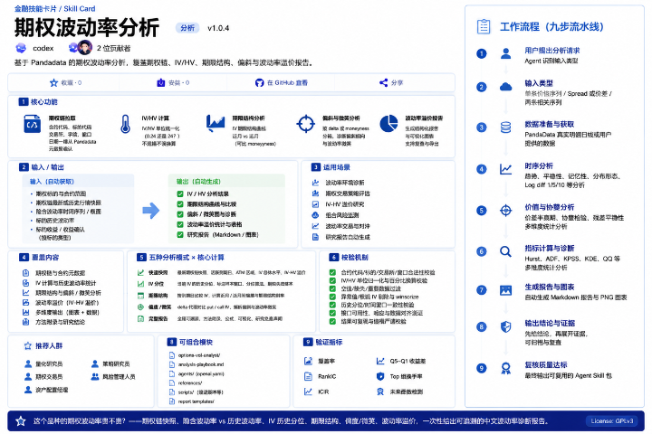</a> |

### 宏观与跨资产（3）

| 项目 | 双语摘要 | 主阶段 | 输入 | 输出 | 接口状态 | 截图 |
|---|---|---|---|---|---|---|
| [skill-global-macro-rates-fx-lab](https://github.com/quantskills/skill-global-macro-rates-fx-lab) | 以公开利率、央行和外汇数据生成可溯源的全球宏观格局简报。 | reporting | — | — | 待维护者审核 / 无公开端点 |  |
| [skill-macro-altdata-nowcast](https://github.com/quantskills/skill-macro-altdata-nowcast) | 利用宏观另类高频数据进行行业景气度现在预测和趋势观察。 | modeling | — | — | 待维护者审核 / 无公开端点 |  |
| [skill-macro-monitor](https://github.com/quantskills/skill-macro-monitor) | 监测宏观数据、行业景气、经济日历和周期性宏观变化。 | monitoring | — | — | 待维护者审核 / 无公开端点 |  |

<strong>04 风险监控与预警</strong> — 19 项资产，含截图 1

### 市场状态（1）

| 项目 | 双语摘要 | 主阶段 | 输入 | 输出 | 接口状态 | 截图 |
|---|---|---|---|---|---|---|
| [skill-market-regime-analysis](https://github.com/quantskills/skill-market-regime-analysis) | 结合指数、宏观、期货期限结构和波动率特征划分A股市场状态。 | modeling | — | — | 待维护者审核 / 无公开端点 |  |

### 资金与拥挤（5）

| 项目 | 双语摘要 | 主阶段 | 输入 | 输出 | 接口状态 | 截图 |
|---|---|---|---|---|---|---|
| [skill-b7-lhb-monitor](https://github.com/quantskills/skill-b7-lhb-monitor) | 监控龙虎榜与席位标签，生成次日关注清单和可筛选的个股详情看板。 | monitoring | — | — | 待维护者审核 / 无公开端点 |  |
| [skill-block-trade-radar](https://github.com/quantskills/skill-block-trade-radar) | 按大宗交易折溢价、成交量和价格证据生成 A 股个股雷达报告。 | monitoring | — | — | 待维护者审核 / 无公开端点 |  |
| [skill-capital-flow-crowding-monitor](https://github.com/quantskills/skill-capital-flow-crowding-monitor) | 聚合融资融券、北向持股和大宗交易，计算资金一致性、背离与拥挤度分位信号。 | monitoring | — | — | 待维护者审核 / 无公开端点 |  |
| [skill-northbound-margin-monitor](https://github.com/quantskills/skill-northbound-margin-monitor) | 监测北向资金、融资融券和期货全景的多类风险信号。 | monitoring | — | — | 待维护者审核 / 无公开端点 |  |
| [skill-smart-money-profiler](https://github.com/quantskills/skill-smart-money-profiler) | 分析龙虎榜席位、北向行为与资金共识或分歧。 | monitoring | — | — | 待维护者审核 / 无公开端点 |  |

### 流动性风险（1）

| 项目 | 双语摘要 | 主阶段 | 输入 | 输出 | 接口状态 | 截图 |
|---|---|---|---|---|---|---|
| [skill-portfolio-liquidity-stress-test](https://github.com/quantskills/skill-portfolio-liquidity-stress-test) | 在成交量压力下估算组合清算天数、期限内变现、赎回缺口和冲击成本。 | risk | — | — | 待维护者审核 / 无公开端点 |  |

### 公司事件（4）

| 项目 | 双语摘要 | 主阶段 | 输入 | 输出 | 接口状态 | 截图 |
|---|---|---|---|---|---|---|
| [skill-buyback-monitor](https://github.com/quantskills/skill-buyback-monitor) | 监测 A 股回购公告生命周期、用途、价格区间和强度并整理研究结果。 | monitoring | — | — | 待维护者审核 / 无公开端点 |  |
| [skill-event-risk-alert](https://github.com/quantskills/skill-event-risk-alert) | 对自选或持仓清单扫描解禁、质押、增减持和业绩等事件风险。 | monitoring | — | — | 待维护者审核 / 无公开端点 | <a href="https://raw.githubusercontent.com/quantskills/quantskills/main/assets/skill-event-risk-alert.png">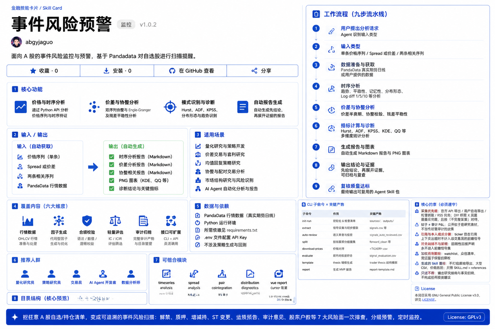</a> |
| [skill-klarman-special-situations](https://github.com/quantskills/skill-klarman-special-situations) | 按特殊情况投资框架研究定增解禁、重组、分拆和困境反转事件。 | modeling | — | — | 待维护者审核 / 无公开端点 |  |
| [skill-refinancing-monitor](https://github.com/quantskills/skill-refinancing-monitor) | 跟踪 A 股再融资生命周期、定价和稀释风险。 | monitoring | — | — | 待维护者审核 / 无公开端点 |  |

### 监管合规（2）

| 项目 | 双语摘要 | 主阶段 | 输入 | 输出 | 接口状态 | 截图 |
|---|---|---|---|---|---|---|
| [skill-audit-opinion-scanner](https://github.com/quantskills/skill-audit-opinion-scanner) | 从审计意见、财务报表和行业对标评估 A 股财务健康并输出风险检查结果。 | evaluation | — | — | 待维护者审核 / 无公开端点 |  |
| [skill-regulatory-risk-radar](https://github.com/quantskills/skill-regulatory-risk-radar) | 汇总 A 股监管与合规风险事件并进行分级。 | monitoring | — | — | 待维护者审核 / 无公开端点 |  |

### 组合压力测试（4）

| 项目 | 双语摘要 | 主阶段 | 输入 | 输出 | 接口状态 | 截图 |
|---|---|---|---|---|---|---|
| [skill-portfolio-checkup](https://github.com/quantskills/skill-portfolio-checkup) | 汇总持仓集中度、基准偏离、估值、质量和风险暴露生成组合健康报告。 | risk | — | — | 待维护者审核 / 无公开端点 |  |
| [skill-quant-portfolio-risk](https://github.com/quantskills/skill-quant-portfolio-risk) | 分析组合风险暴露、约束和压力情景。 | risk | — | — | 待维护者审核 / 无公开端点 |  |
| [skill-risk-model](https://github.com/quantskills/skill-risk-model) | 构建多因子风险模型并进行风险归因。 | risk | — | — | 待维护者审核 / 无公开端点 |  |
| [skill-rolling-beta-exposure](https://github.com/quantskills/skill-rolling-beta-exposure) | 估计资产或组合相对于基准的滚动贝塔暴露。 | risk | — | — | 待维护者审核 / 无公开端点 |  |

### 自动预警（2）

| 项目 | 双语摘要 | 主阶段 | 输入 | 输出 | 接口状态 | 截图 |
|---|---|---|---|---|---|---|
| [skill-a-share-market-risk-radar](https://github.com/quantskills/skill-a-share-market-risk-radar) | 扫描 A 股宏观、资金、估值、趋势、行业轮动与个股事件并汇总风险等级。 | monitoring | — | — | 待维护者审核 / 无公开端点 |  |
| [skill-b6-limitup-pool](https://github.com/quantskills/skill-b6-limitup-pool) | 维护每日涨停池，记录首板、连板、炸板、回封、题材和情绪指标并生成看板。 | monitoring | — | — | 待维护者审核 / 无公开端点 |  |

<strong>05 策略回测与交易工具</strong> — 19 项资产，含截图 2

### 策略与信号（4）

| 项目 | 双语摘要 | 主阶段 | 输入 | 输出 | 接口状态 | 截图 |
|---|---|---|---|---|---|---|
| [skill-global-macro-trend-strategy](https://github.com/quantskills/skill-global-macro-trend-strategy) | 将海外信号和公开日线价格转为可回测的研究策略、仓位和风控规则。 | backtesting | — | — | 待维护者审核 / 无公开端点 |  |
| [skill-ma-crossover-signal](https://github.com/quantskills/skill-ma-crossover-signal) | 计算均线交叉交易信号并提供回测评估。 | factor-generation | — | — | 待维护者审核 / 无公开端点 |  |
| [skill-oversold-rebound](https://github.com/quantskills/skill-oversold-rebound) | 判断A股短期超跌反弹环境并筛选候选股票。 | factor-screening | — | — | 待维护者审核 / 无公开端点 |  |
| [skill-qbti](https://github.com/quantskills/skill-qbti) | 通过五部分问答将用户偏好转换为因子方向和策略参数。 | portfolio-construction | — | — | 待维护者审核 / 无公开端点 |  |

### 组合构建（2）

| 项目 | 双语摘要 | 主阶段 | 输入 | 输出 | 接口状态 | 截图 |
|---|---|---|---|---|---|---|
| [skill-dalio-all-weather](https://github.com/quantskills/skill-dalio-all-weather) | 针对A股股票、债券、黄金和商品资产提供全天候配置与回测流程。 | portfolio-construction | — | — | 待维护者审核 / 无公开端点 |  |
| [skill-portfolio-optimize](https://github.com/quantskills/skill-portfolio-optimize) | 将alpha信号转为受权重、行业、暴露和换手约束的优化组合权重。 | portfolio-construction | — | — | 待维护者审核 / 无公开端点 |  |

### 回测引擎（2）

| 项目 | 双语摘要 | 主阶段 | 输入 | 输出 | 接口状态 | 截图 |
|---|---|---|---|---|---|---|
| [skill-backtest](https://github.com/quantskills/skill-backtest) | 提供横截面多头回测协议，固定 T+1 开盘成交、费用、涨跌停剔除与诊断图表。 | backtesting | — | — | 待维护者审核 / 无公开端点 | <a href="https://raw.githubusercontent.com/quantskills/quantskills/main/assets/skill-backtest.png">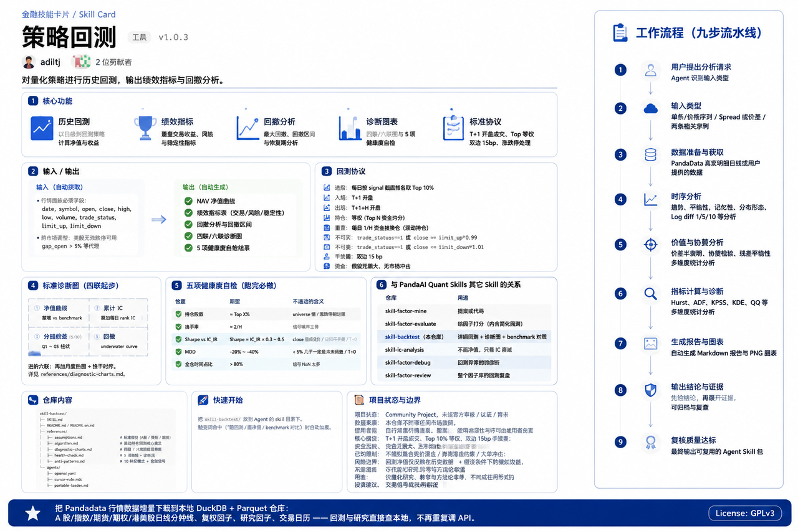</a> |
| [skill-factor-backtest](https://github.com/quantskills/skill-factor-backtest) | 对给定因子和行情数据执行long-only横截面因子回测并生成诊断报告。 | backtesting | — | — | 待维护者审核 / 无公开端点 |  |

### 绩效归因（5）

| 项目 | 双语摘要 | 主阶段 | 输入 | 输出 | 接口状态 | 截图 |
|---|---|---|---|---|---|---|
| [skill-brinson-performance-attribution](https://github.com/quantskills/skill-brinson-performance-attribution) | 执行 Brinson-Fachler 或 BHB 归因、HHI 与贡献排序，并支持 Carino 多期链接。 | evaluation | — | — | 待维护者审核 / 无公开端点 |  |
| [skill-portfolio-attribution](https://github.com/quantskills/skill-portfolio-attribution) | 将组合主动收益分解为行业配置、个股选择、交互效应和因子贡献。 | evaluation | — | — | 待维护者审核 / 无公开端点 |  |
| [skill-portfolio-pnl-attribution](https://github.com/quantskills/skill-portfolio-pnl-attribution) | 按证券和行业归因组合已实现收益，并对账费用、基准和输入质量。 | evaluation | — | — | 待维护者审核 / 无公开端点 |  |
| [skill-risk-return-metrics](https://github.com/quantskills/skill-risk-return-metrics) | 计算投资组合或策略的风险收益指标。 | evaluation | — | — | 待维护者审核 / 无公开端点 |  |
| [skill-strategy-tearsheet-report](https://github.com/quantskills/skill-strategy-tearsheet-report) | 生成包含风险调整指标的策略绩效 tearsheet。 | reporting | — | — | 待维护者审核 / 无公开端点 |  |

### 交易成本（2）

| 项目 | 双语摘要 | 主阶段 | 输入 | 输出 | 接口状态 | 截图 |
|---|---|---|---|---|---|---|
| [skill-transaction-cost-analysis](https://github.com/quantskills/skill-transaction-cost-analysis) | 将成交记录相对 VWAP/TWAP 分解为多类交易成本。 | evaluation | — | — | 待维护者审核 / 无公开端点 |  |
| [skill-transaction-cost-calibration](https://github.com/quantskills/skill-transaction-cost-calibration) | 从成交和市场数据校准佣金、价差、滑点与冲击成本假设。 | evaluation | — | — | 待维护者审核 / 无公开端点 |  |

### 微观结构（1）

| 项目 | 双语摘要 | 主阶段 | 输入 | 输出 | 接口状态 | 截图 |
|---|---|---|---|---|---|---|
| [skill-quant-execution-microstructure](https://github.com/quantskills/skill-quant-execution-microstructure) | 将已批准的交易目标转化为可观测的成本感知执行方案。 | execution | — | — | 待维护者审核 / 无公开端点 |  |

### 仓位与订单（2）

| 项目 | 双语摘要 | 主阶段 | 输入 | 输出 | 接口状态 | 截图 |
|---|---|---|---|---|---|---|
| [skill-b11-auto-stop-loss-take-profit](https://github.com/quantskills/skill-b11-auto-stop-loss-take-profit) | 按入场日期和开盘价规则判断止盈、止损、强平，并控制单票仓位上限。 | execution | — | — | 待维护者审核 / 无公开端点 |  |
| [skill-b12-intraday-position-manager](https://github.com/quantskills/skill-b12-intraday-position-manager) | 在日内交易中按可卖与锁定数量、价格和现金管理多标的仓位。 | execution | — | — | 待维护者审核 / 无公开端点 |  |

### 模拟与实盘执行（1）

| 项目 | 双语摘要 | 主阶段 | 输入 | 输出 | 接口状态 | 截图 |
|---|---|---|---|---|---|---|
| [skill-ssquant-ai-trader](https://github.com/quantskills/skill-ssquant-ai-trader) | 组织 SSQuant 策略研究、模拟交易和运行检查。 | execution | — | — | 待维护者审核 / 无公开端点 | <a href="https://raw.githubusercontent.com/quantskills/quantskills/main/assets/skill-ssquant-ai-trader.png">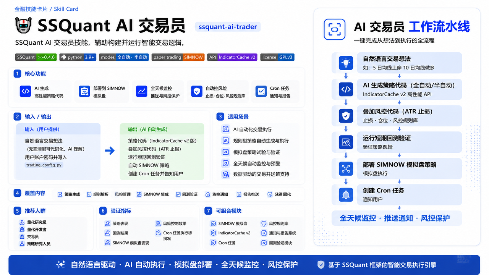</a> |

<strong>06 投研模型与研究复现</strong> — 18 项资产，含截图 7

### 论文复现（2）

| 项目 | 双语摘要 | 主阶段 | 输入 | 输出 | 接口状态 | 截图 |
|---|---|---|---|---|---|---|
| [skill-paper-replication](https://github.com/quantskills/skill-paper-replication) | 支持论文检索、数据提取、实验复现和研究结果报告。 | modeling | — | — | 待维护者审核 / 无公开端点 | <a href="https://raw.githubusercontent.com/quantskills/quantskills/main/assets/skill-paper-replication.png">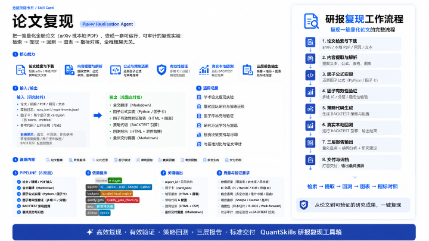</a> |
| [skill-quant-research-replication](https://github.com/quantskills/skill-quant-research-replication) | 指导可审计的量化研究复现流程。 | modeling | — | — | 待维护者审核 / 无公开端点 | <a href="https://raw.githubusercontent.com/quantskills/quantskills/main/assets/skill-quant-research-replication.png">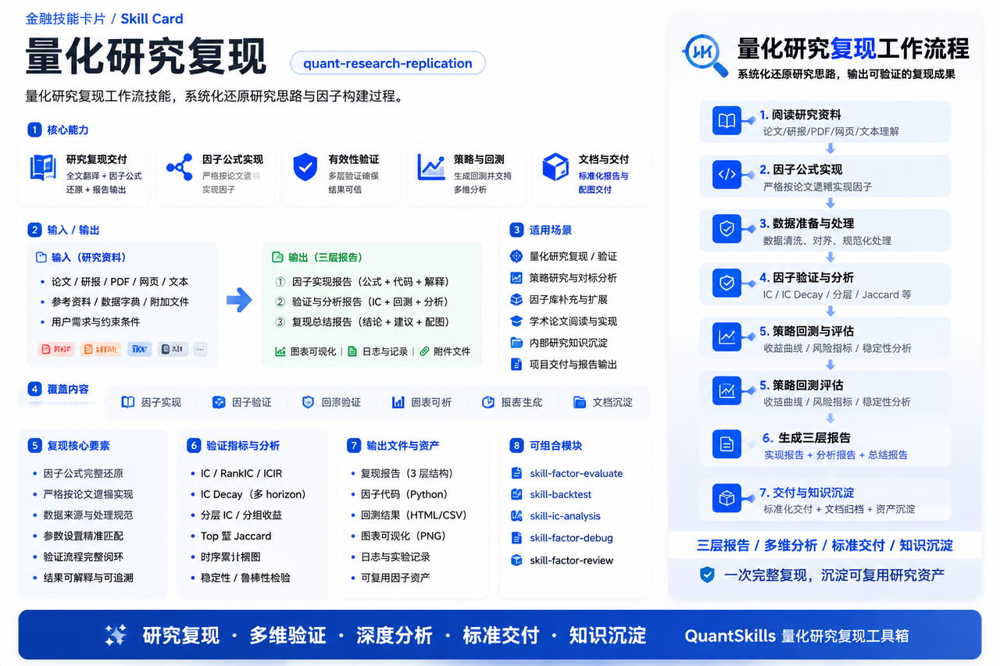</a> |

### 策略复现（1）

| 项目 | 双语摘要 | 主阶段 | 输入 | 输出 | 接口状态 | 截图 |
|---|---|---|---|---|---|---|
| [skill-report-replication](https://github.com/quantskills/skill-report-replication) | 指导将研究报告转化为可复现的分析流程。 | modeling | — | — | 待维护者审核 / 无公开端点 | <a href="https://raw.githubusercontent.com/quantskills/quantskills/main/assets/skill-report-replication.png">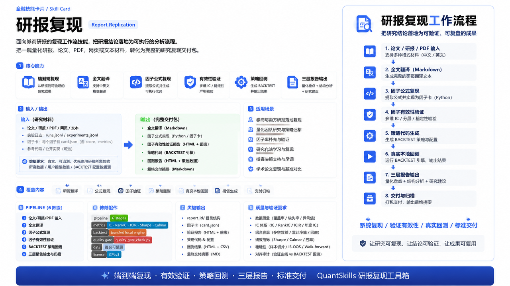</a> |

### 统计与机器学习模型（6）

| 项目 | 双语摘要 | 主阶段 | 输入 | 输出 | 接口状态 | 截图 |
|---|---|---|---|---|---|---|
| [skill-dl-gnn-stock-graph](https://github.com/quantskills/skill-dl-gnn-stock-graph) | 构建A股多层异构图并使用图神经网络进行量化选股与回测。 | modeling | — | — | 待维护者审核 / 无公开端点 |  |
| [skill-model-hpo-evidence-driven](https://github.com/quantskills/skill-model-hpo-evidence-driven) | 以固定验证流程和试验级证据优化量化多因子模型超参数。 | modeling | — | — | 待维护者审核 / 无公开端点 |  |
| [skill-pair-correlation](https://github.com/quantskills/skill-pair-correlation) | 计算和解释资产对的相关性、滚动关系及其研究用途。 | evaluation | — | — | 待维护者审核 / 无公开端点 |  |
| [skill-simons-pairs-trading](https://github.com/quantskills/skill-simons-pairs-trading) | 研究 A 股配对交易的协整、价差和执行约束。 | modeling | — | — | 待维护者审核 / 无公开端点 |  |
| [skill-statistical-arbitrage-time-series](https://github.com/quantskills/skill-statistical-arbitrage-time-series) | 构建统计套利时间序列研究并生成可追溯报告。 | modeling | — | — | 待维护者审核 / 无公开端点 |  |
| [skill-time-series-analysis](https://github.com/quantskills/skill-time-series-analysis) | 对金融时间序列进行诊断并生成分析报告。 | modeling | — | — | 待维护者审核 / 无公开端点 | <a href="https://raw.githubusercontent.com/quantskills/quantskills/main/assets/skill-time-series-analysis.png">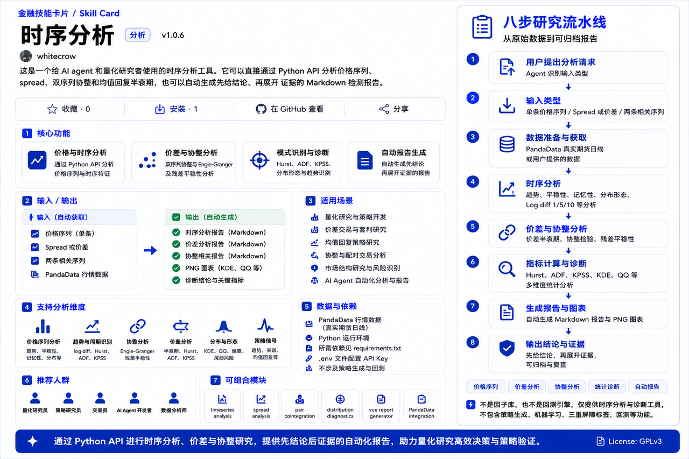</a> |

### 投资者研究模型（7）

| 项目 | 双语摘要 | 主阶段 | 输入 | 输出 | 接口状态 | 截图 |
|---|---|---|---|---|---|---|
| [skill-gaetano-crux-capital-research-model](https://github.com/quantskills/skill-gaetano-crux-capital-research-model) | 以公开资料拆解光子、光网络和AI基础设施公司的研究证据与风险。 | modeling | — | — | 待维护者审核 / 无公开端点 | <a href="https://raw.githubusercontent.com/quantskills/quantskills/main/assets/skill-gaetano-crux-capital-research-model.png">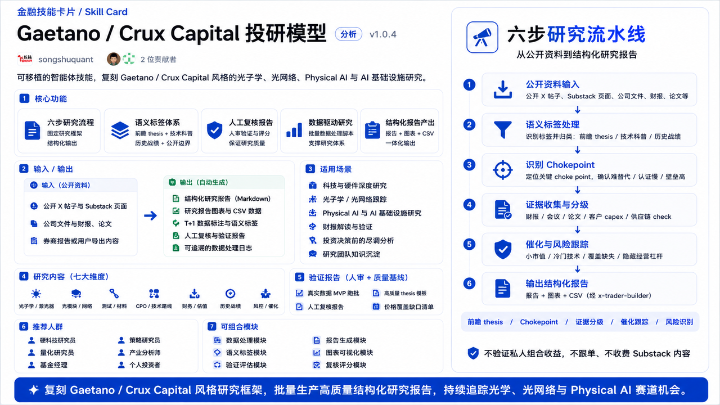</a> |
| [skill-gao-shanwen-research-model](https://github.com/quantskills/skill-gao-shanwen-research-model) | 整理、检索和学习高善文公开著作与文章。 | reporting | — | — | 待维护者审核 / 无公开端点 |  |
| [skill-investment-decision](https://github.com/quantskills/skill-investment-decision) | 整合研究证据、估值和风险信息，形成可追溯的投资决策报告。 | modeling | — | — | 待维护者审核 / 无公开端点 |  |
| [skill-keynes-contrarian-investment](https://github.com/quantskills/skill-keynes-contrarian-investment) | 运用长期预期和反共识框架识别过度乐观、悲观及价值陷阱。 | modeling | — | — | 待维护者审核 / 无公开端点 |  |
| [skill-munger-mental-model](https://github.com/quantskills/skill-munger-mental-model) | 运用多元思维模型框架生成公司投资研究和判断报告。 | modeling | — | — | 待维护者审核 / 无公开端点 |  |
| [skill-serenity-research-model](https://github.com/quantskills/skill-serenity-research-model) | 从公开 X/Twitter 证据重建 Serenity 风格的研究逻辑。 | modeling | — | — | 待维护者审核 / 无公开端点 | <a href="https://raw.githubusercontent.com/quantskills/quantskills/main/assets/skill-serenity-research-model.png">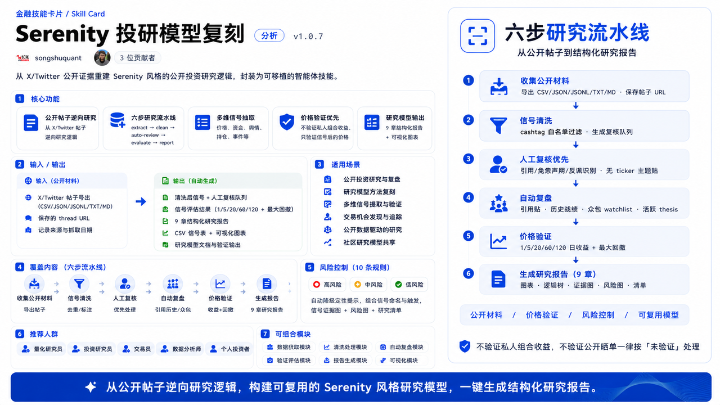</a> |
| [skill-x-trader-builder](https://github.com/quantskills/skill-x-trader-builder) | 从公开 X/Twitter 帖子数据构建交易者专属研究模型技能。 | orchestration | — | — | 待维护者审核 / 无公开端点 | <a href="https://raw.githubusercontent.com/quantskills/quantskills/main/assets/skill-x-trader-builder.png">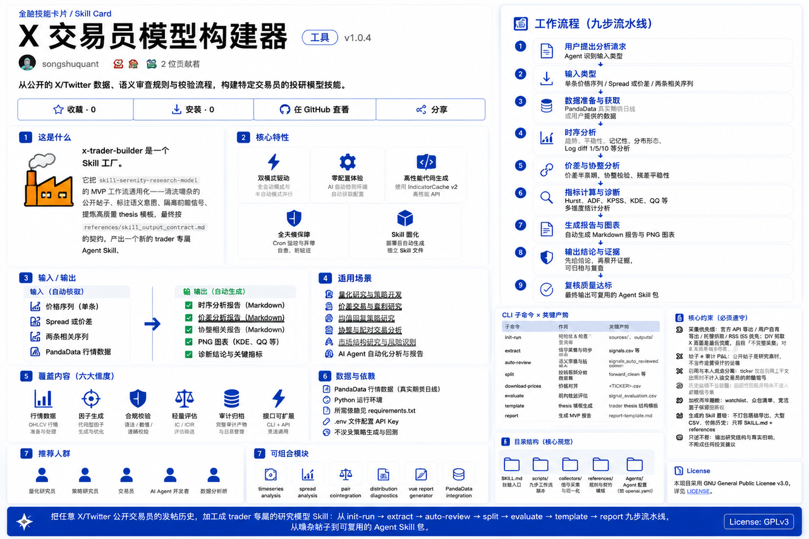</a> |

### 实验登记与可重复研究（2）

| 项目 | 双语摘要 | 主阶段 | 输入 | 输出 | 接口状态 | 截图 |
|---|---|---|---|---|---|---|
| [skill-quant-research](https://github.com/quantskills/skill-quant-research) | 指导量化研究、回测设计和统计验证工作流。 | modeling | — | — | 待维护者审核 / 无公开端点 |  |
| [skill-quant-research-experiment-registry](https://github.com/quantskills/skill-quant-research-experiment-registry) | 登记量化实验并审计其可复现性证据。 | evaluation | — | — | 待维护者审核 / 无公开端点 |  |

<strong>07 研究验证与质量工具</strong> — 11 项资产，含截图 1

### 前视与数据泄漏（2）

| 项目 | 双语摘要 | 主阶段 | 输入 | 输出 | 接口状态 | 截图 |
|---|---|---|---|---|---|---|
| [skill-backtesting-bias-avoidance](https://github.com/quantskills/skill-backtesting-bias-avoidance) | 构建无前视偏差的回测并审计前视、幸存者、过拟合、成本和样本外检验风险。 | evaluation | — | — | 待维护者审核 / 无公开端点 |  |
| [skill-numerical-leak-check](https://github.com/quantskills/skill-numerical-leak-check) | 通过数值测试检测量化研究流程中的前视和数据泄漏。 | evaluation | — | — | 待维护者审核 / 无公开端点 |  |

### 幸存者偏差（1）

| 项目 | 双语摘要 | 主阶段 | 输入 | 输出 | 接口状态 | 截图 |
|---|---|---|---|---|---|---|
| [skill-survivorship-universe-auditor](https://github.com/quantskills/skill-survivorship-universe-auditor) | 审计回测前的点时证券池成员、标识和退市收益数据。 | data-quality | — | — | 待维护者审核 / 无公开端点 |  |

### Walk-forward 与 OOS（2）

| 项目 | 双语摘要 | 主阶段 | 输入 | 输出 | 接口状态 | 截图 |
|---|---|---|---|---|---|---|
| [skill-backtest-overfit](https://github.com/quantskills/skill-backtest-overfit) | 评估回测过拟合与多重检验风险，计算 DSR、PBO、净化交叉验证和 Harvey-Liu 折减。 | evaluation | — | — | 待维护者审核 / 无公开端点 |  |
| [skill-walk-forward-validator](https://github.com/quantskills/skill-walk-forward-validator) | 用净化和隔离的滚动窗口验证截面信号的样本外表现。 | evaluation | — | — | 待维护者审核 / 无公开端点 |  |

### 信号稳定性（3）

| 项目 | 双语摘要 | 主阶段 | 输入 | 输出 | 接口状态 | 截图 |
|---|---|---|---|---|---|---|
| [skill-calendar-anomaly-scanner](https://github.com/quantskills/skill-calendar-anomaly-scanner) | 从带日期收益序列扫描日历异常，结合稳健检验、Bootstrap 和多重检验校正输出结果。 | evaluation | — | — | 待维护者审核 / 无公开端点 |  |
| [skill-factor-decay](https://github.com/quantskills/skill-factor-decay) | 分析多期限Rank IC、换手和分组收益的衰减，并估计半衰期。 | evaluation | — | — | 待维护者审核 / 无公开端点 |  |
| [skill-signal-stability-audit](https://github.com/quantskills/skill-signal-stability-audit) | 审计量化信号跨期和跨样本的稳定性。 | evaluation | — | — | 待维护者审核 / 无公开端点 |  |

### 预测校准（1）

| 项目 | 双语摘要 | 主阶段 | 输入 | 输出 | 接口状态 | 截图 |
|---|---|---|---|---|---|---|
| [skill-forecast-calibration-audit](https://github.com/quantskills/skill-forecast-calibration-audit) | 审计概率预测的校准程度，而非只评估样本排序。 | evaluation | — | — | 待维护者审核 / 无公开端点 |  |

### 数值与模型审计（1）

| 项目 | 双语摘要 | 主阶段 | 输入 | 输出 | 接口状态 | 截图 |
|---|---|---|---|---|---|---|
| [skill-factor-debug](https://github.com/quantskills/skill-factor-debug) | 提供按症状、病因和验证手段组织的因子失效诊断手册。 | evaluation | — | — | 待维护者审核 / 无公开端点 | <a href="https://raw.githubusercontent.com/quantskills/quantskills/main/assets/skill-factor-debug.png">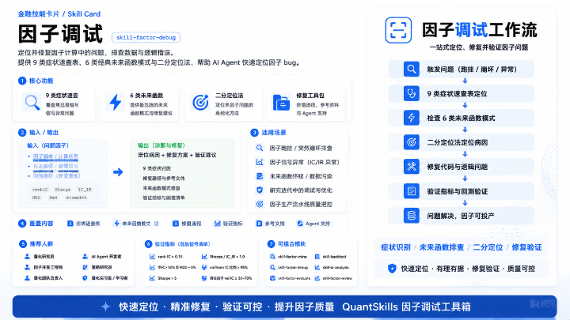</a> |

### 工作流审计（1）

| 项目 | 双语摘要 | 主阶段 | 输入 | 输出 | 接口状态 | 截图 |
|---|---|---|---|---|---|---|
| [skill-pandaai-workflow-audit](https://github.com/quantskills/skill-pandaai-workflow-audit) | 审计PandaAI工作流的图结构、代码、时序、参数和回测验证证据。 | evaluation | — | — | 待维护者审核 / 无公开端点 |  |

<strong>08 资讯搜索与知识分析</strong> — 6 项资产，含截图 1

### 新闻与公告（3）

| 项目 | 双语摘要 | 主阶段 | 输入 | 输出 | 接口状态 | 截图 |
|---|---|---|---|---|---|---|
| [skill-earnings-season-tracker](https://github.com/quantskills/skill-earnings-season-tracker) | 在财报季扫描业绩预告、行业分布和审计非标事项。 | monitoring | — | — | 待维护者审核 / 无公开端点 |  |
| [skill-fin-news](https://github.com/quantskills/skill-fin-news) | 聚合财经快讯和市场数据，精选头条并撰写分析文章。 | reporting | — | — | 待维护者审核 / 无公开端点 |  |
| [skill-news-sentiment-analyst](https://github.com/quantskills/skill-news-sentiment-analyst) | 采集、核验并分析A股财经新闻情绪，生成研究报告。 | modeling | — | — | 待维护者审核 / 无公开端点 |  |

### 机构研究（1）

| 项目 | 双语摘要 | 主阶段 | 输入 | 输出 | 接口状态 | 截图 |
|---|---|---|---|---|---|---|
| [skill-institutional-research-tracker](https://github.com/quantskills/skill-institutional-research-tracker) | 监测A股机构调研活动、关注度及其变化。 | monitoring | — | — | 待维护者审核 / 无公开端点 |  |

### 每日复盘（2）

| 项目 | 双语摘要 | 主阶段 | 输入 | 输出 | 接口状态 | 截图 |
|---|---|---|---|---|---|---|
| [skill-daily-report](https://github.com/quantskills/skill-daily-report) | 汇总多个市场的行情、板块、资金和新闻数据，生成每日 Markdown 复盘报告。 | reporting | — | — | 待维护者审核 / 无公开端点 |  |
| [skill-market-daily-review](https://github.com/quantskills/skill-market-daily-review) | 生成基于Pandadata的A股收盘后每日市场复盘报告。 | reporting | — | — | 待维护者审核 / 无公开端点 | <a href="https://raw.githubusercontent.com/quantskills/quantskills/main/assets/skill-market-daily-review.png">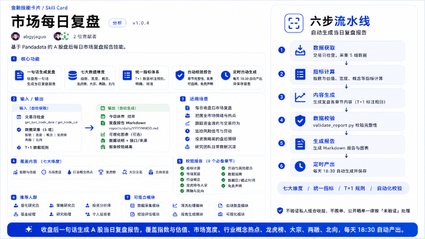</a> |

<strong>09 量化智能体与自动化</strong> — 8 项资产，含截图 5

### 研究 Agent（2）

| 项目 | 双语摘要 | 主阶段 | 输入 | 输出 | 接口状态 | 截图 |
|---|---|---|---|---|---|---|
| [agent-correlation-break-research](https://github.com/quantskills/agent-correlation-break-research) | 用 Pandadata 多资产收益相关性变化识别风格切换、分散化压力与结构性行情。 | monitoring | — | — | 待维护者审核 / 无公开端点 | <a href="https://raw.githubusercontent.com/quantskills/quantskills/main/assets/agent-correlation-break-research.png">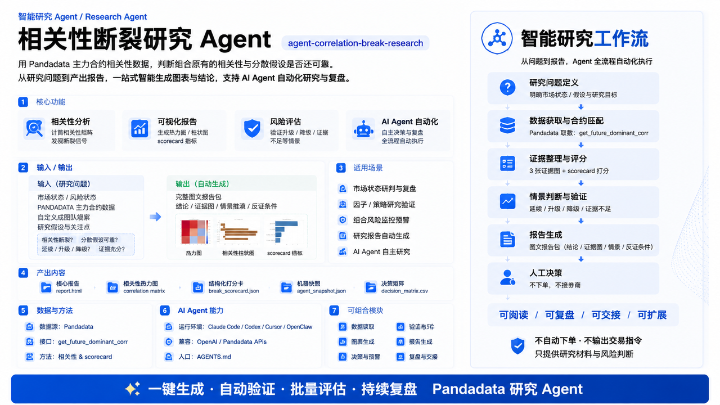</a> |
| [agent-macro-driven-rotation](https://github.com/quantskills/agent-macro-driven-rotation) | 以改进美林时钟定相、景气 Nowcast 和估值过滤生成宏观驱动行业轮动研究材料。 | modeling | — | — | 待维护者审核 / 无公开端点 |  |

### 监控与风险 Agent（3）

| 项目 | 双语摘要 | 主阶段 | 输入 | 输出 | 接口状态 | 截图 |
|---|---|---|---|---|---|---|
| [agent-crowding-risk-monitor](https://github.com/quantskills/agent-crowding-risk-monitor) | 用 Pandadata 价格、成交、融资和龙虎榜热度识别抱团、过热、踩踏与去杠杆风险。 | monitoring | — | — | 待维护者审核 / 无公开端点 | <a href="https://raw.githubusercontent.com/quantskills/quantskills/main/assets/agent-crowding-risk-monitor.png">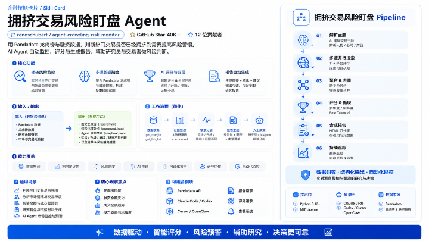</a> |
| [agent-derivatives-skew-sentiment-monitor](https://github.com/quantskills/agent-derivatives-skew-sentiment-monitor) | 用期权隐含波动率和标的历史波动率观察衍生品市场风险偏好。 | monitoring | — | — | 待维护者审核 / 无公开端点 | <a href="https://raw.githubusercontent.com/quantskills/quantskills/main/assets/agent-derivatives-skew-sentiment-monitor.png">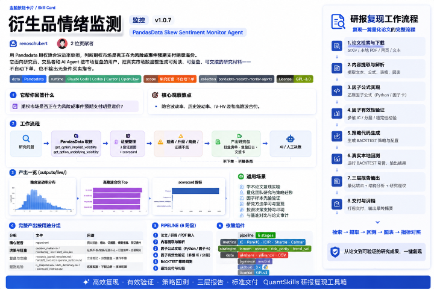</a> |
| [agent-market-regime-monitor](https://github.com/quantskills/agent-market-regime-monitor) | 用 Pandadata 行情、指数宽度、波动率和资金证据判断趋势、震荡、退潮或风险扩张状态。 | monitoring | — | — | 待维护者审核 / 无公开端点 | <a href="https://raw.githubusercontent.com/quantskills/quantskills/main/assets/agent-market-regime-monitor.png">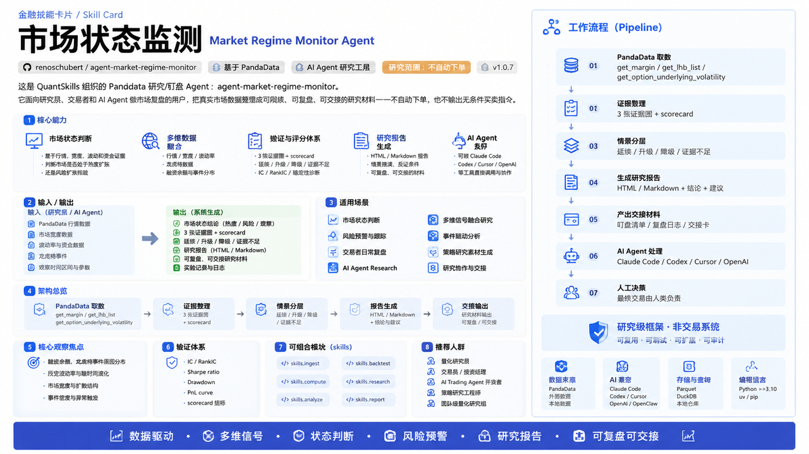</a> |

### 交易执行 Agent（1）

| 项目 | 双语摘要 | 主阶段 | 输入 | 输出 | 接口状态 | 截图 |
|---|---|---|---|---|---|---|
| [agent-ssquant](https://github.com/quantskills/agent-ssquant) | SSQuant Agent 组织期货策略、数据服务、CTP 门禁检查和中文回测报告工作流。 | execution | — | — | 待维护者审核 / 无公开端点 |  |

### 工作流编排 Agent（2）

| 项目 | 双语摘要 | 主阶段 | 输入 | 输出 | 接口状态 | 截图 |
|---|---|---|---|---|---|---|
| [agent-for-liangshuyuan-tasks](https://github.com/quantskills/agent-for-liangshuyuan-tasks) | 面向量枢院任务的多 Agent 协作框架，组织量化交易工具、构建流程与任务分工。 | orchestration | — | — | 待维护者审核 / 无公开端点 |  |
| [agent-quantspace](https://github.com/quantskills/agent-quantspace) | 面向 AI 编码代理的量化研究框架，组织数据、技能、策略、回测和报告工作流。 | orchestration | — | — | 待维护者审核 / 无公开端点 | <a href="https://raw.githubusercontent.com/quantskills/quantskills/main/assets/agent-quantspace.png">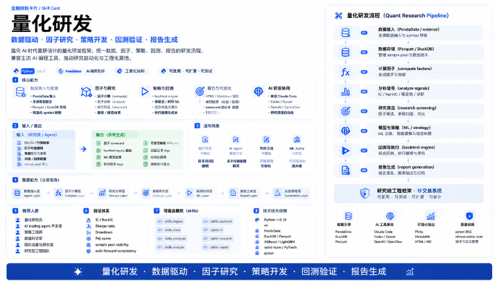</a> |

<strong>10 基础设施与模板</strong> — 6 项资产，含截图 1

### Skill 模板（1）

| 项目 | 双语摘要 | 主阶段 | 输入 | 输出 | 接口状态 | 截图 |
|---|---|---|---|---|---|---|
| [skill-template](https://github.com/quantskills/skill-template) | 提供 QuantSkills 技能项目的模板结构和说明。 | orchestration | — | — | 待维护者审核 / 无公开端点 |  |

### Agent 模板（1）

| 项目 | 双语摘要 | 主阶段 | 输入 | 输出 | 接口状态 | 截图 |
|---|---|---|---|---|---|---|
| [agent-template](https://github.com/quantskills/agent-template) | 用于创建可移植 QuantSkills 智能体项目的规范模板。 | orchestration | — | — | 待维护者审核 / 无公开端点 |  |

### 构建与发布工具（4）

| 项目 | 双语摘要 | 主阶段 | 输入 | 输出 | 接口状态 | 截图 |
|---|---|---|---|---|---|---|
| [skill-jq-to-panda-converter](https://github.com/quantskills/skill-jq-to-panda-converter) | 将聚宽量化策略代码转换为可运行回测的PandaAI JSON策略配置。 | orchestration | — | — | 待维护者审核 / 无公开端点 |  |
| [skill-pandaai-workflow-generator](https://github.com/quantskills/skill-pandaai-workflow-generator) | 根据量化想法生成可导入PandaAI的工作流JSON及策略或因子代码。 | orchestration | — | — | 待维护者审核 / 无公开端点 |  |
| [skill-quant-factor-skill-factory](https://github.com/quantskills/skill-quant-factor-skill-factory) | 批量生成、验证并打包框架中立的 OHLCV 因子技能。 | orchestration | — | — | 待维护者审核 / 无公开端点 | <a href="https://raw.githubusercontent.com/quantskills/quantskills/main/assets/skill-quant-factor-skill-factory.png">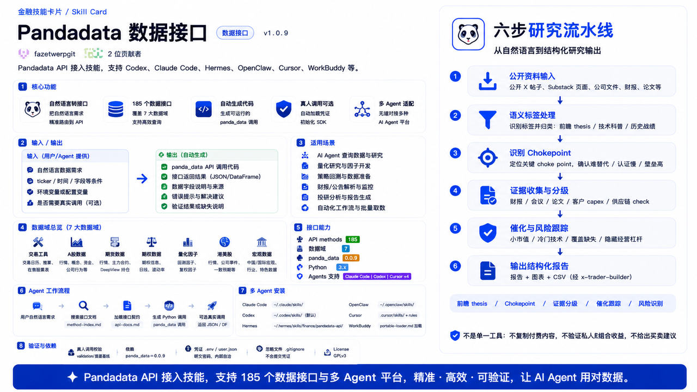</a> |
| [skill-ssquant-trader-generator](https://github.com/quantskills/skill-ssquant-trader-generator) | 将自然语言交易想法转换为可复用的 Trader Skill，并委托模拟部署流程。 | orchestration | — | — | 待维护者审核 / 无公开端点 |  |

## 基础设施与社区入口

| Project | Link |
|---|---|
| .github | [https://github.com/quantskills/.github](https://github.com/quantskills/.github) |
| join | [https://github.com/quantskills/join](https://github.com/quantskills/join) |
| quantskills | [https://github.com/quantskills/quantskills](https://github.com/quantskills/quantskills) |
| registry | [https://github.com/quantskills/registry](https://github.com/quantskills/registry) |

---
## 🐼 PandaAI 社群

  
   
  扫码加入 PandaAI 社群，交流 QUANTSKILLS 技能、Agent 工作流与量化研究实践。

<!-- CATALOG:END -->

## 维护与许可

维护者：[quantskills-GuoYJ](https://github.com/quantskills-GuoYJ) 与 QuantSkills 社区。目录内容以各资产仓库声明的许可证为准；本导航仓库请参见其 [LICENSE](LICENSE)。
